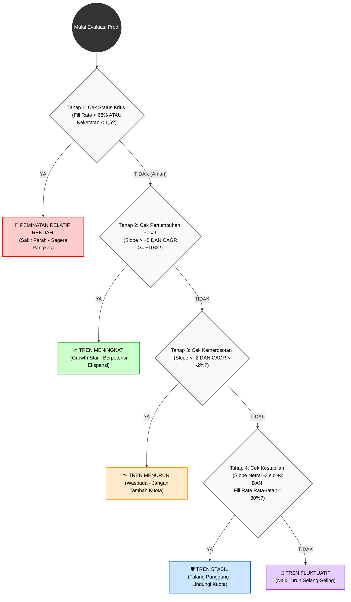

# Bagan Algoritma: Klasifikasi Tren Prodi (Decision Tree)

Bagan di bawah ini menggambarkan alur penyaringan otomatis yang digunakan untuk mengklasifikasikan tren 81 program studi selama 5 tahun terakhir (2022-2026).

## Mengapa Menggunakan Pendekatan Ini?

Algoritma *Decision Tree* ini dirancang untuk memastikan analisis yang **terstruktur dan objektif (M.E.C.E - Mutually Exclusive, Collectively Exhaustive)**:

1. **Mutually Exclusive:** Tidak ada satupun prodi yang bisa masuk ke dua kategori sekaligus karena sistem penyaringannya berjalan berurutan. Begitu sebuah prodi tertangkap di satu saringan, ia tidak akan dievaluasi di saringan berikutnya.
2. **Collectively Exhaustive:** Tidak ada satupun prodi yang terlewat. Jika sebuah prodi gagal memenuhi kriteria ekstrem (sangat buruk, sangat bagus, merosot tajam, atau sangat stabil), maka ia akan otomatis ditangkap oleh keranjang terakhir (Tren Fluktuatif).

Dengan visualisasi ini, keputusan pimpinan dalam menambah atau memangkas kuota tidak lagi didasarkan pada asumsi, melainkan pada pembuktian algoritma yang matematis.
