# LAPORAN ANALISIS PEMINATAN, DAYA TAMPUNG, DAN PENDAFTARAN ULANG PROGRAM STUDI UNIVERSITAS SYIAH KUALA (2022–2026)
## Evaluasi Tren Multi-Tahun, Efisiensi Kapasitas Kuota, Kausalitas Lapangan, dan Pertimbangan Strategis PMB Menuju Rasionalisasi Kuota PTN-BH

---

**Forum Penugasan:** TUGAS 05 - MAGANG (KHUSUS)  
**Judul Resmi:** Analisa Peminatan dan Daya Tampung Program Studi Universitas Syiah Kuala  
**Penyusun:** Tim Magang Universitas Syiah Kuala  
**Periode Analisis:** 5 Tahun Akademik (2022 s.d. 2026)  
**Basis Data Sumber:** 
1. Data Historis (2022–2025): `tugas-5/rekap data.xlsx` (Sheet *Rekapitulasi Data*)
2. Data Tahun 2026: `DAYA_TAMPUNG_2026_2027 GANJIL_MAGANG.xlsx` (Sheet *DT D3_D4_S1 2026*)  
**Master Excel:** `tugas-5/analisa_peminatan_dan_daya_tampung/data/master_analisa_peminatan_dan_daya_tampung_2022_2026.xlsx`  
**Paket Grafik (300 DPI):** `tugas-5/analisa_peminatan_dan_daya_tampung/grafik/`  
**File Presentasi PowerPoint (.pptx):** `tugas-5/analisa_peminatan_dan_daya_tampung/presentasi_analisa_peminatan_dan_daya_tampung.pptx`  

---

## DAFTAR ISI LAPORAN

1. **BAB 1: RINGKASAN EKSEKUTIF (MEMBEDAH SEGITIGA EMAS PMB USK)**
2. **BAB 2: METODOLOGI ANALISIS, PEMISAHAN SEGMEN, & FORMULA OBJEKTIF**
3. **BAB 3: EVALUASI TREN MAKRO UNIVERSITAS SYIAH KUALA (2022–2026)**
4. **BAB 4: PETA TINGKAT KEKETATAN SELEKSI: PRODI PALING FAVORIT VS SEPI PEMINAT**
5. **BAB 5: PETA PENINGKATAN & PENURUNAN PROGRAM STUDI S1 KAMPUS UTAMA**
6. **BAB 6: EVALUASI EFISIENSI KUOTA & FENOMENA OVER-EKSPANSI (MARGINAL FILL RATE)**
7. **BAB 7: DARI JALUR APA MAHASISWA MASUK? (ANALISIS JALUR PENERIMAAN & KEBOCORAN)**
8. **BAB 8: EKSPLORASI KAUSALITAS LAPANGAN: FAKTA DATA VS TEMUAN DESK RESEARCH**
9. **BAB 9: EVALUASI KLASTER KHUSUS: D3 VOKASI & PSDKU GAYO LUES**
10. **BAB 10: INTEGRASI JALUR INTERNASIONAL, FLYER PMB, & REKOMENDASI KUOTA 2027**
11. **LAMPIRAN: TABEL MASTER LENGKAP 81 PROGRAM STUDI USK (2022–2026)**

---

## BAB 1: RINGKASAN EKSEKUTIF (MEMBEDAH SEGITIGA EMAS PMB USK)

Laporan ini disusun untuk menjawab mandat strategis pimpinan universitas dan panduan resmi `TUGAS 05 - MAGANG (KHUSUS).pdf`. Fokus utama analisis terletak pada interaksi dinamis antara tiga variabel pokok atau **Segitiga Emas PMB USK**:

```
                          SEGITIGA EMAS ANALISIS PMB USK
                          
                                DAYA TAMPUNG (DT)
                           (Berapa Kuota yang Dibuka?)
                                     ^      ^
                                    /        \
                                   /          \
                                  v            v
                         PEMINAT (DEMAND) <---> DAFTAR ULANG (DU)
                    (Berapa yang Berminat?)    (Berapa Riil Masuk & Mengisi Kursi?)
                                       |
                                       v
                       ANALISIS PENYEBAB LAPANGAN (THE "WHY")
                 • Mengapa Prodi A Tinggi (Daftar Ulang & Kuota Naik)?
                 • Mengapa Prodi B Rendah (Peminat Lesu & Kursi Bolong)?
```

### 1.1 Temuan Pokok Peminatan (Demand) vs Daya Tampung (Kapasitas)
1. **Peminat USK Tumbuh Positif:** Secara makro, total peminat USK melonjak dari **48.769 orang (2022)** menjadi **68.010 orang (2026)**, bahkan sempat menyentuh rekor tertinggi **70.945 peminat pada tahun 2025** (+39,5% selama 5 tahun).
2. **Kapasitas Kuota Melompat Pasca-PTN-BH:** Target daya tampung dinaikkan agresif sebesar **+32,7%** (dari 7.863 menjadi 10.435 kursi) sebagai konsekuensi perluasan kapasitas PTN-BH sejak 2024.
3. **Disparitas Keketatan Seleksi Sangat Ekstrem:** 
   * Prodi terfavorit seperti *Farmasi* mencatat rasio keketatan **39,2 peminat per 1 kursi** (3.526 peminat untuk 90 kursi).
   * Sebaliknya, prodi eksakta tertentu seperti *Budidaya Perairan* mencatat rasio keketatan **0,91 peminat per 1 kursi** (hanya 145 peminat untuk 160 kursi). Secara matematis, kuota prodi ini mustahil terisi penuh karena jumlah orang yang mendaftar lebih sedikit dari kursi yang disiapkan.

### 1.2 Temuan Pokok Realisasi Pendaftaran Ulang & Beban 2.000 Kursi Kosong
1. **Realisasi Mahasiswa Masuk Tumbuh:** Jumlah mahasiswa baru yang mendaftar ulang meningkat dari **6.197 mhs (2022)** menjadi **8.440 mhs (2026)** atau naik **+36,2%**, dengan tingkat keterisian rata-rata kampus mencapai **80,9%**.
2. **Beban Struktural 2.000 Bangku Kosong:** Terlepas dari kenaikan mahasiswa masuk, USK **secara persisten menyisakan sekitar 2.000 kursi kosong setiap tahunnya** (2022: 1.666 kursi; 2023: 2.481 kursi; 2024: 2.449 kursi; 2025: 2.393 kursi; 2026: 1.995 kursi kosong).
3. **Penyebab Utama Kursi Kosong:** Terjadi **fenomena over-ekspansi kuota** pada prodi yang sepi peminat. Menambah kuota 2x lipat pada prodi seperti *Budidaya Perairan, Teknologi Hasil Pertanian, Pendidikan Ekonomi, dan Teknik Kimia* terbukti tidak menambah mahasiswa secara proporsional, melainkan hanya memperlebar tumpukan kursi kosong (**50–70 kursi kosong per prodi pada 2026**).

### 1.3 Temuan Kausalitas Lapangan: Mengapa Prodi A Tinggi vs Mengapa Prodi B Rendah?
* **Mengapa Prodi A (PGSD, Keperawatan, Teknik Komputer) Tinggi?**
  * *PGSD:* Tumbuh spektakuler (+106% / 105 ke 217 mhs) berkat dibukanya ribuan formasi guru ASN/PPPK di Aceh.
  * *Ilmu Keperawatan:* Melonjak drastis (+132% / 127 ke 295 mhs) berkat terbukanya pasar kerja ners internasional bergaji tinggi ke Jepang dan Jerman melalui program G-to-G. Kampus berani menaikkan kuota karena pasar menyerap habis lulusan.
* **Mengapa Prodi B (Manajemen FEB, Budidaya Perairan, Fisika) Rendah / Menurun?**
  * *Manajemen FEB:* Merosot 3 tahun beruntun (-25% / 266 ke 199 mhs) akibat *kanibalisasi internal* oleh dibukanya prodi baru S1 Bisnis Digital pada 2024 yang menyerap 800+ peminat.
  * *Budidaya Perairan & Fisika:* Persepsi minimnya formasi kerja kantoran di daerah serta materi sains murni yang dihindari generasi muda.
  * *Jalur Mandiri:* Tagihan Iuran Pengembangan Institusi (IPI) belasan hingga puluhan juta rupiah dalam tempo 5 hari kerja (SK Rektor 1162/2026) memicu *liquidity shock*, menyebabkan 25% calon mahasiswa yang lulus memilih gugur.
  * *Jalur TALENTA:* Sebanyak 75% siswa lolos (930 orang) kabur karena tiket Talenta dijadikan cadangan gratis sambil menunggu pengumuman UTBK SNBT.

---

## BAB 2: METODOLOGI ANALISIS, PEMISAHAN SEGMEN, & FORMULA OBJEKTIF

Sesuai arahan pengguna dan standar profesional *Higher Education Analytics*, analisis ini menerapkan segmentasi ketat dan metrik yang bebas dari bias titik ujung (*endpoint bias*).

### 2.1 Pemisahan 3 Segmen Analisis Secara Ketat
Untuk mencegah distorsi data statistik, seluruh 81 program studi USK dipisahkan ke dalam 3 klaster independen:
1. **S1 Kampus Utama (Banda Aceh):** 66 program studi sarjana reguler.
2. **Diploma 3 Vokasi:** 11 program studi diploma tiga di Banda Aceh.
3. **PSDKU Gayo Lues:** 4 program studi di Kampus Luar Gayo Lues (outlier geografis).

---

### 2.2 Formula Indikator Analitik Utama

1. **Rasio Keketatan Seleksi Peminatan:**
   $$\text{Rasio Keketatan} = \frac{\text{Jumlah Peminat}}{\text{Daya Tampung (DT)}}$$
   *Mengukur seberapa kompetitif prodi tersebut (berapa orang peminat memperebutkan 1 kursi).*

2. **Tingkat Keterisian Kuota (Capacity Fill Rate %):**
   $$\text{Capacity Fill Rate (\%)} = \left( \frac{\text{Mahasiswa Daftar Ulang Riil (DU)}}{\text{Daya Tampung (DT)}} \right) \times 100\%$$
   *Mengukur efisiensi pemanfaatan aset kampus: dari 100 kursi yang dibuka, berapa kursi yang terisi?*

3. **Tingkat Konversi Kelulusan (Admissions Yield Rate %):**
   $$\text{Admissions Yield Rate (\%)} = \left( \frac{\text{Mahasiswa Daftar Ulang Riil (DU)}}{\text{Calon Lulus Seleksi (LA)}} \right) \times 100\%$$
   *Mengukur loyalitas calon mahasiswa: dari 100 anak yang dinyatakan lulus, berapa yang setia mendaftar ulang dan tidak mengundurkan diri?*

4. **Sisa Kursi Kosong (Unfilled Gap):**
   $$\text{Sisa Kursi Kosong} = \max(0, \, \text{DT} - \text{DU})$$
   *Mengukur defisit bangku kuliah yang tidak menghasilkan penerimaan UKT.*

5. **Laju Perubahan Riil Tahunan (Slope Tren OLS - Orang/Tahun):**
   $$m = \frac{n \sum (x_i y_i) - \sum x_i \sum y_i}{n \sum x_i^2 - (\sum x_i)^2}$$
   *Dihitung menggunakan regresi linear OLS pada 5 titik tahun ($x_i \in \{2022..2026\}$) untuk mengeliminasi bias titik ujung (endpoint bias).*

6. **Laju Pertumbuhan Majemuk Tahunan (CAGR %):**
   $$\text{CAGR (\%)} = \left[ \left( \frac{\text{Nilai}_{2026}}{\text{Nilai}_{2022}} \right)^{\frac{1}{4}} - 1 \right] \times 100\%$$
   *Mengukur kecepatan pertumbuhan tahunan rata-rata yang dinormalisasi.*

7. **Rasio Penyerapan Kuota Tambahan (Marginal Fill Rate):**
   $$\text{Marginal Fill Rate} = \frac{\Delta \text{DU}}{\Delta \text{DT}} = \frac{\text{DU}_{2026} - \text{DU}_{2022}}{\text{DT}_{2026} - \text{DT}_{2022}}$$
   *Mengukur efektivitas kuota: setiap USK membuka 10 kursi tambahan, berapa kursi yang riil terisi mahasiswa baru? Jika nilainya rendah ($<0{,}30$) atau negatif, ini bukti mutlak terjadinya over-ekspansi kuota.*


---

### 2.3 Aturan Klasifikasi 5 Kategori Tren (Tahap 6 Panduan Magang)
1. **Tren Meningkat:** Slope DU > +5 mhs/thn dan CAGR DU >= +10% per tahun (atau konsisten 4x naik).
2. **Tren Menurun:** Slope DU < -2 mhs/thn dan CAGR DU < -2% per tahun (atau konsisten 3x turun).
3. **Tren Stabil:** Nilai Slope berada di kisaran netral (-3 s.d. +3 mhs/thn) dengan keterisian rata-rata >= 80%.
4. **Tren Fluktuatif:** Pola pergerakan naik-turun bergantian dipengaruhi persepsi passing grade sesaat.
5. **Peminatan Relatif Rendah:** Rata-rata Keterisian 5 Tahun < 68% atau Rasio Keketatan Seleksi 2026 < 1,5 : 1.

---

## BAB 3: EVALUASI TREN MAKRO UNIVERSITAS SYIAH KUALA (2022–2026)

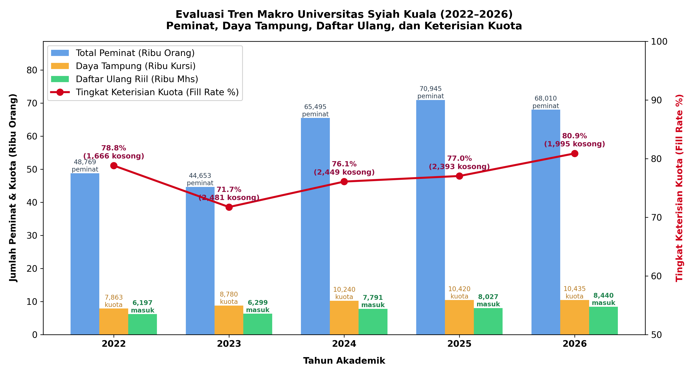

### 3.1 Data Historis Agregat Universitas (81 Program Studi)

| Tahun Akademik | Total Peminat (Orang) | Daya Tampung (Kursi) | Lulus Seleksi (Orang) | Daftar Ulang (Orang) | Keterisian Kuota (Fill Rate %) | Konversi (Yield Rate %) | Sisa Kursi Kosong (Bangku) |
| :---: | :---: | :---: | :---: | :---: | :---: | :---: | :---: |
| **2022** | 48.769 | 7.863 | 7.428 | **6.197** | **78,8%** | **83,4%** | 1.666 Kursi |
| **2023** | 44.653 | 8.780 | 7.728 | **6.299** | **71,7%** | **81,5%** | 2.481 Kursi |
| **2024** | 65.495 | 10.240 | 10.158 | **7.791** | **76,1%** | **76,7%** | 2.449 Kursi |
| **2025** | 70.945 | 10.420 | 9.487 | **8.027** | **77,0%** | **84,6%** | 2.393 Kursi |
| **2026** | 68.010 | 10.435 | 10.776 | **8.440** | **80,9%** | **78,3%** | 1.995 Kursi |

### 3.2 Analisis Dinamika Makro:
* **Fase Ekspansi Kapasitas (2023–2024):** USK memperluas kuota secara masif (+1.460 kursi di 2024) saat menyandang status PTN-BH. Kenaikan kuota ini direspon positif oleh pasar dengan lonjakan peminat dari 44 ribu ke 65 ribu orang.
* **Tingkat Keterisian Membaik di 2026:** Keterisian kuota mencapai level terbaiknya di angka **80,9%** dengan 8.440 mahasiswa baru resmi terdaftar.
* **Persistensi Masalah Kursi Kosong:** Angka kursi kosong tidak pernah turun di bawah 1.600 kursi. Di tahun 2026, masih terdapat **1.995 kursi yang gagal diisi mahasiswa**, mencerminkan adanya ketidaksesuaian alokasi kuota antar-program studi.

---

## BAB 4: PETA TINGKAT KEKETATAN SELEKSI: PRODI PALING FAVORIT VS SEPI PEMINAT

Analisis tingkat keketatan seleksi (Rasio Peminat terhadap Daya Tampung) dilakukan melalui dua lensa analitik komparatif:
1. **Lensa Terkini (Tahun 2026):** Memotret kondisi peta kompetisi mutakhir calon mahasiswa.
2. **Lensa Historis 5 Tahun (Benchmark 2022–2026):** Mengeliminasi bias anomali tahunan sesaat dan memetakan daya tarik struktural jangka panjang.

---

### 4.1 Peta Keketatan Seleksi Terkini (Tahun 2026)

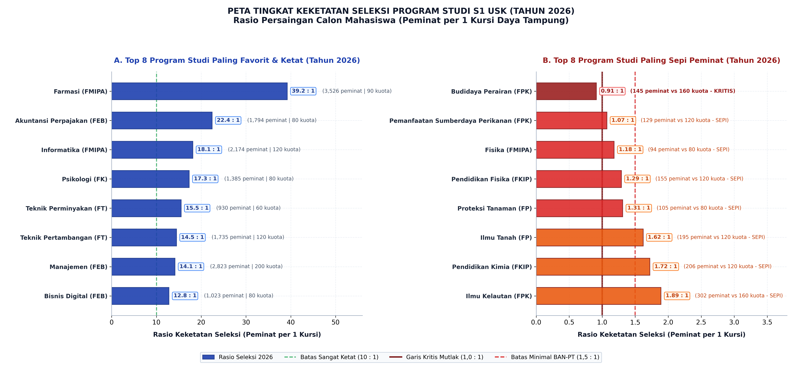

Rasio keketatan seleksi tahun 2026 menunjukkan tingkat persaingan riil calon mahasiswa untuk memperebutkan 1 bangku kuliah di USK:

#### Top 8 Program Studi Paling Ketat / Favorit (Tahun 2026):
1. **Farmasi (FMIPA):** Rasio **39,2 : 1** (3.526 peminat memperebutkan 90 kursi).
2. **Akuntansi Perpajakan (D4 FEB):** Rasio **22,4 : 1** (1.794 peminat untuk 80 kursi).
3. **Informatika (FMIPA):** Rasio **18,1 : 1** (2.174 peminat untuk 120 kursi).
4. **Psikologi (FK):** Rasio **17,3 : 1** (1.385 peminat untuk 80 kursi).
5. **Teknik Perminyakan (FT):** Rasio **15,5 : 1** (930 peminat untuk 60 kursi).
6. **Teknik Pertambangan (FT):** Rasio **14,5 : 1** (1.735 peminat untuk 120 kursi).
7. **Manajemen (FEB):** Rasio **14,1 : 1** (2.823 peminat untuk 200 kursi).
8. **Bisnis Digital (FEB):** Rasio **12,8 : 1** (1.023 peminat untuk 80 kursi).

#### Top 8 Program Studi Paling Rendah Keketatan / Sepi Peminat (Tahun 2026):
1. **Budidaya Perairan (FPK):** Rasio **0,91 : 1** (145 peminat untuk 160 kursi).  
   *Catatan Kritis: Peminat lebih sedikit dari daya tampung, secara matematis mustahil terisi penuh.*
2. **Pemanfaatan Sumberdaya Perikanan (FPK):** Rasio **1,07 : 1** (129 peminat untuk 120 kursi).
3. **Fisika (FMIPA):** Rasio **1,18 : 1** (94 peminat untuk 80 kursi).
4. **Pendidikan Fisika (FKIP):** Rasio **1,29 : 1** (155 peminat untuk 120 kursi).
5. **Proteksi Tanaman (FP):** Rasio **1,31 : 1** (105 peminat untuk 80 kursi).
6. **Ilmu Tanah (FP):** Rasio **1,62 : 1** (195 peminat untuk 120 kursi).
7. **Pendidikan Kimia (FKIP):** Rasio **1,72 : 1** (206 peminat untuk 120 kursi).
8. **Ilmu Kelautan (FPK):** Rasio **1,89 : 1** (302 peminat untuk 160 kursi).

---

### 4.2 Benchmark Tingkat Keketatan Seleksi 5 Tahun (2022–2026)


Analisis deret waktu 5 tahun membuktikan bahwa polarisasi minat calon mahasiswa di USK bukanlah fenomena insidental, melainkan **ketimpangan preferensi struktural yang persisten selama setengah dekade**:

#### A. Top 10 Program Studi Paling Favorit & Ketat (Rata-rata 5 Tahun):
| No | Program Studi | Fakultas | Rata-rata Keketatan 5 Thn | Rata-rata Peminat/Thn | Tren Rasio (2022 $\rightarrow$ 2026) | Dinamika Minat |
| :---: | :--- | :--- | :---: | :---: | :---: | :--- |
| 1 | **Farmasi** | FMIPA | **44,1 : 1** | 3.220 orang | 50,8x $\rightarrow$ 39,2x (▼) | Juara bertahan favorit tertinggi di USK |
| 2 | **Informatika** | FMIPA | **21,5 : 1** | 2.302 orang | 24,4x $\rightarrow$ 18,1x (▼) | Favorit utama sektor teknologi digital |
| 3 | **Psikologi** | Kedokteran | **17,3 : 1** | 1.385 orang | 14,3x $\rightarrow$ 17,3x (▲) | Permintaan layanan kesehatan mental melonjak |
| 4 | **Pendidikan Dokter Gigi** | Kedokteran Gigi | **17,2 : 1** | 1.646 orang | 19,6x $\rightarrow$ 12,0x (▼) | Selektivitas profesi medis stabil tinggi |
| 5 | **Akuntansi Perpajakan** | Ekonomi & Bisnis | **14,2 : 1** | 1.109 orang | 0,3x $\rightarrow$ 22,4x (▲) | Prodi sarjana terapan baru dengan lonjakan pesat |
| 6 | **Pendidikan Dokter** | Kedokteran | **14,1 : 1** | 3.531 orang | 16,4x $\rightarrow$ 8,0x (▼) | Peminat volume tertinggi, rasio melonggar pasca ekspansi kuota |
| 7 | **Teknik Pertambangan** | Teknik | **13,2 : 1** | 1.426 orang | 10,6x $\rightarrow$ 14,5x (▲) | Daya tarik industri mineral dan hilirisasi |
| 8 | **Bimbingan Konseling** | FKIP | **12,9 : 1** | 1.650 orang | 11,6x $\rightarrow$ 11,7x (▲) | Konsisten favorit di rumpun pendidikan |
| 9 | **Manajemen** | Ekonomi & Bisnis | **11,8 : 1** | 2.618 orang | 8,5x $\rightarrow$ 14,1x (▲) | Volume pelamar terbesar rumpun Soshum |
| 10 | **Teknik Komputer** | Teknik | **11,7 : 1** | 1.596 orang | 15,7x $\rightarrow$ 9,2x (▼) | Kebutuhan talenta IoT dan hardware |

#### B. Top 10 Program Studi Paling Sepi Peminat (Rata-rata 5 Tahun):
| No | Program Studi | Fakultas | Rata-rata Keketatan 5 Thn | Rata-rata Peminat/Thn | Rata-rata Daya Tampung | Status Krisis Seleksi |
| :---: | :--- | :--- | :---: | :---: | :---: | :--- |
| 1 | **Fisika** | FMIPA | **0,85 : 1** | 75 orang | 92 kursi | **KRITIS MUTLAK:** Peminat < Daya Tampung |
| 2 | **Budidaya Perairan** | Kelautan & Perikanan | **1,01 : 1** | 170 orang | 168 kursi | **KRITIS MUTLAK:** Kuota mustahil terisi penuh |
| 3 | **Pemanfaatan Sumberdaya Perikanan** | Kelautan & Perikanan | **1,13 : 1** | 142 orang | 126 kursi | Di bawah ambang minimal BAN-PT (1,5 : 1) |
| 4 | **Pendidikan Fisika** | FKIP | **1,31 : 1** | 157 orang | 122 kursi | Di bawah ambang minimal BAN-PT (1,5 : 1) |
| 5 | **Proteksi Tanaman** | Pertanian | **1,40 : 1** | 106 orang | 76 kursi | Di bawah ambang minimal BAN-PT (1,5 : 1) |
| 6 | **Pendidikan Kimia** | FKIP | **1,60 : 1** | 183 orang | 114 kursi | Keketatan sangat rendah |
| 7 | **Teknik Sumber Daya Air** | Teknik | **1,72 : 1** | 117 orang | 70 kursi | Prodi spesialisasi keairan baru |
| 8 | **Ilmu Tanah** | Pertanian | **1,76 : 1** | 180 orang | 106 kursi | Keketatan rendah |
| 9 | **Teknologi Industri Hasil Perikanan** | Kelautan & Perikanan | **1,87 : 1** | 103 orang | 60 kursi | Keketatan rendah |
| 10 | **Ilmu Kelautan** | Kelautan & Perikanan | **1,96 : 1** | 328 orang | 168 kursi | Keketatan rendah |

> **Temuan Kunci Data Analyst:**  
> Dua program studi (Fisika dan Budidaya Perairan) secara persisten selama 5 tahun berturut-turut mencatatkan rata-rata rasio di bawah atau tepat di angka $\mathbf{1{,}0 : 1}$. Artinya, tanpa perlu menyeleksi kemampuan akademik, seluruh pendaftar yang masuk pun tetap tidak mampu memenuhi kuota yang dibuka universitas. Program studi ini wajib menjadi prioritas utama kebijakan perampingan daya tampung.


## BAB 5: PETA PENINGKATAN & PENURUNAN PROGRAM STUDI S1 KAMPUS UTAMA

Evaluasi program studi sarjana di Banda Aceh dilakukan secara objektif dengan menyandingkan **Slope Tren Regresi OLS (Laju Mahasiswa Riil per Tahun)** dan **CAGR Majemuk (% per Tahun)**.

### 5.1 Program Studi dengan Pertumbuhan Tertinggi (Top Growth)

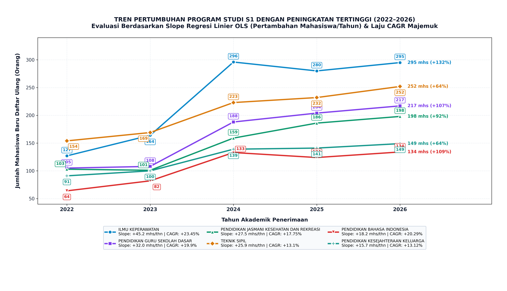

| No | Program Studi | Fakultas | DU 2022 | DU 2026 | Slope Tren DU (Orang/Thn) | CAGR DU (%/Thn) | Riwayat Transisi YoY | Pola Konsistensi |
| :---: | :--- | :---: | :---: | :---: | :---: | :---: | :---: | :--- |
| 1 | **Ilmu Keperawatan** | Keperawatan | 127 | 295 | **+38,4** | **+23,5%** | 3x Naik, 1x Turun | Meningkat Pesat |
| 2 | **Pendidikan Guru SD (PGSD)** | FKIP | 105 | 217 | **+27,4** | **+19,9%** | **4x Naik Berturut-turut** | **Konsisten Sempurna** |
| 3 | **Teknik Sipil** | Teknik | 154 | 252 | **+23,0** | **+13,1%** | 3x Naik, 1x Turun | Meningkat Pesat |
| 4 | **Penjaskesrek** | FKIP | 103 | 198 | **+22,3** | **+17,8%** | 3x Naik, 1x Turun | Meningkat Pesat |
| 5 | **Pendidikan Bahasa Indonesia** | FKIP | 64 | 134 | **+18,0** | **+20,3%** | 3x Naik, 1x Turun | Meningkat Pesat |
| 6 | **Teknik Komputer** | Teknik | 85 | 145 | **+14,8** | **+14,3%** | 3x Naik, 1x Turun | Meningkat Pesat |
| 7 | **Kehutanan** | Pertanian | 51 | 89 | **+8,9** | **+14,9%** | **4x Naik Berturut-turut** | **Konsisten Sempurna** |
| 8 | **Pendidikan Geografi** | FKIP | 71 | 119 | **+11,3** | **+13,8%** | **4x Naik Berturut-turut** | **Konsisten Sempurna** |
| 9 | **PPKn** | FKIP | 77 | 129 | **+12,1** | **+13,8%** | **4x Naik Berturut-turut** | **Konsisten Sempurna** |

> **Temuan Kunci:** PGSD, Kehutanan, Pendidikan Geografi, dan PPKn mencatat rekor sempurna **4 tahun berturut-turut selalu bertumbuh tanpa pernah sekalipun mengalami penurunan peminat maupun pendaftar ulang**.

---

### 5.2 Program Studi dengan Penurunan Terdalam (Top Decline)

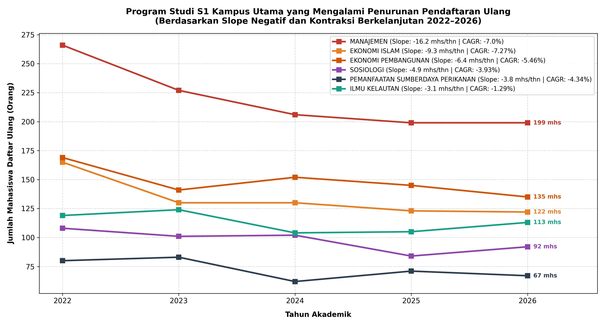

| No | Program Studi | Fakultas | DU 2022 | DU 2026 | Slope Tren DU (Orang/Thn) | CAGR DU (%/Thn) | Riwayat Transisi YoY | Pola Konsistensi |
| :---: | :--- | :---: | :---: | :---: | :---: | :---: | :---: | :--- |
| 1 | **Manajemen** | FEB | 266 | 199 | **-16,4** | **-7,0%** | **0x Naik, 3x Turun** | **Merosot Kronis** |
| 2 | **Ekonomi Islam** | FEB | 165 | 122 | **-10,3** | **-7,3%** | **0x Naik, 3x Turun** | **Merosot Kronis** |
| 3 | **Ekonomi Pembangunan** | FEB | 169 | 135 | **-7,7** | **-5,5%** | 1x Naik, 3x Turun | Menurun Konsisten |
| 4 | **Sosiologi** | FISIP | 108 | 92 | **-4,0** | **-3,9%** | 2x Naik, 2x Turun | Fluktuatif Menurun |
| 5 | **PSP Perikanan** | FPK | 80 | 67 | **-3,7** | **-4,3%** | 2x Naik, 2x Turun | Fluktuatif Menurun |
| 6 | **Matematika** | FMIPA | 67 | 56 | **-2,9** | **-4,4%** | 2x Naik, 2x Turun | Menurun Konsisten |
| 7 | **Teknik Geofisika** | Teknik | 59 | 51 | **-1,8** | **-3,6%** | 1x Naik, 2x Turun | Menurun Moderat |

> **Temuan Kunci:** Manajemen dan Ekonomi Islam (FEB) tidak pernah mengalami kenaikan pendaftar ulang sejak 2022 (3 tahun berturut-turut merosot). Hal ini menjadi peringatan darurat bagi pimpinan fakultas untuk mereformasi kurikulum dan strategi pemasarannya.

---

## BAB 6: EVALUASI EFISIENSI KUOTA & FENOMENA OVER-EKSPANSI (MARGINAL FILL RATE)


Salah satu temuan paling berharga dari evaluasi ini adalah membuktikan secara matematis bahwa **penambahan kuota daya tampung tidak otomatis menambah mahasiswa baru**.

Hal ini diuji menggunakan **Marginal Fill Rate (Rasio Penyerapan Kuota Tambahan)**:

| Program Studi | DT 2022 | DT 2026 | Tambahan Kuota | Tambahan Mahasiswa Masuk | Marginal Fill Rate | Kursi Kosong 2026 | Evaluasi Kapasitas |
| :--- | :---: | :---: | :---: | :---: | :---: | :---: | :--- |
| **Budidaya Perairan** | 180 | 160 | -20 | 0 | **0,00** | **70 Kursi** | **Gagal Total (Over-Ekspansi)** |
| **Teknologi Hasil Pertanian** | 80 | 160 | +80 | +50 | **0,62** | **58 Kursi** | **Over-Ekspansi Parsial** |
| **Pendidikan Ekonomi** | 100 | 160 | +60 | +24 | **0,40** | **57 Kursi** | **Over-Ekspansi (Hanya 40% Terserap)** |
| **Teknik Kimia** | 140 | 180 | +40 | +24 | **0,60** | **60 Kursi** | **Over-Ekspansi Parsial** |

### Analisis Kasus Nyata:
* **Budidaya Perairan:** Kuota dibuka 160 kursi, padahal peminatnya hanya 145 orang dan yang daftar ulang selalu macet di 90 orang. Membuka kuota 160 kursi menghasilkan **70 kursi kosong semu**.
* **Pendidikan Ekonomi:** Kuota dinaikkan 60 kursi, tapi yang masuk hanya bertambah 24 orang (efektivitas hanya 40%), menyisakan **57 kursi kosong**.
* **Dampak Manajerial:** Merasionalkan kuota keempat prodi ini kembali ke kapasitas riil 90–120 kursi akan **langsung menghapus ~245 kursi kosong** tanpa mengurangi jumlah mahasiswa yang masuk.

---

### 6.2 Matriks 4 Kuadran Portofolio Strategis Program Studi S1 USK (2026)

Untuk memberikan peta navigasi kebijakan yang instan dan komprehensif bagi Rektor dan para Dekan, seluruh 66 Program Studi S1 Kampus Utama dipetakan ke dalam **Matriks 4 Kuadran Strategis (Higher Education Strategic Portfolio Matrix)**:

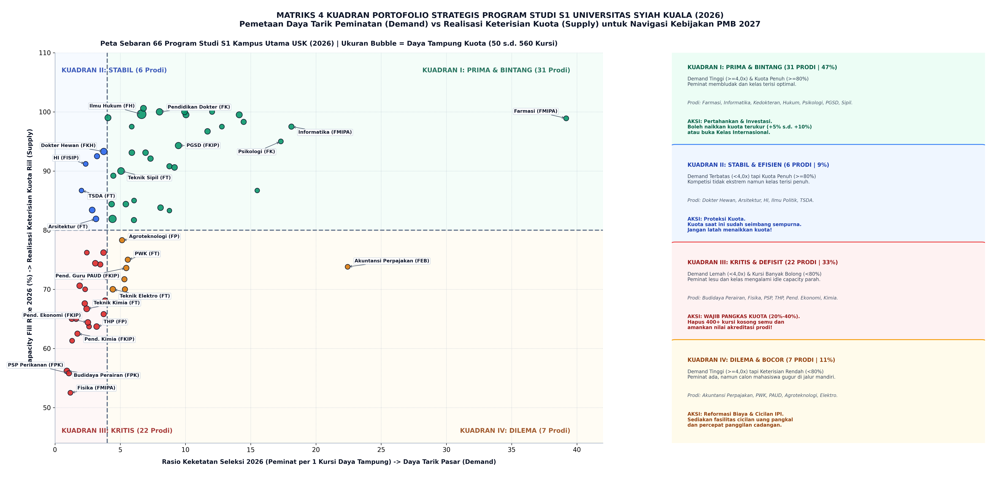

Matriks ini menyilangkan dua dimensi utama:
* **Sumbu X (Horizontal):** **Rasio Keketatan Seleksi 2026 (Daya Tarik Pasar / Demand)**. Garis pemisah: $\text{Rasio} = 4{,}0 : 1$.
* **Sumbu Y (Vertikal):** **Capacity Fill Rate 2026 % (Realisasi Keterisian Kuota / Supply)**. Garis pemisah: $\text{Fill Rate} = 80{,}0\%$.

#### Pemetaan 4 Kuadran & Rekomendasi Manajerial Eksekutif (Tahun 2026):

| Kuadran | Klasifikasi Strategis | Jumlah Prodi (%) | Karakteristik Kinerja PMB | Daftar Program Studi Representatif | Tindakan Kebijakan Rektorat & Dekan |
| :---: | :--- | :---: | :--- | :--- | :--- |
| **I** | **PRIMA & BINTANG (Star Assets)** | **31 Prodi** (47,0%) | Peminat membludak ($\text{Keketatan} \ge 4{,}0$) dan kuota terisi penuh ($\text{Fill Rate} \ge 80\%$). | *Farmasi, Informatika, Psikologi, Pend. Dokter, Kedokteran Gigi, Manajemen FEB, Akuntansi, Ilmu Hukum, PGSD, Teknik Sipil, Agribisnis.* | **Pertahankan & Investasi:** Boleh menaikkan kuota terukur (+5% s.d. +10%) atau membuka **Kelas Internasional** karena pasar pasti menyerap. |
| **II** | **STABIL & EFISIEN (Core Cash Cows)** | **6 Prodi** (9,1%) | Peminat tidak terlalu membludak ($\text{Keketatan} < 4{,}0$), tetapi kuota terisi optimal ($\ge 80\%$). | *Pend. Dokter Hewan, Arsitektur, Hubungan Internasional, Ilmu Politik, Teknik Sumber Daya Air (TSDA), Pend. Sendratasik.* | **Lindungi & Jaga Kuota Tetap Stabil:** Jangan latah menaikkan kuota; kuota saat ini sudah seimbang sempurna (*equilibrium*) dengan daya serapnya. |
| **III** | **KRITIS & DEFISIT (Critical Under-Enrolled)** | **22 Prodi** (33,3%) | Peminat sepi ($\text{Keketatan} < 4{,}0$) dan bangku kuliah banyak bolong ($\text{Fill Rate} < 80\%$). | *Budidaya Perairan, Fisika, PSP Perikanan, Teknologi Hasil Pertanian (THP), Pend. Ekonomi, Pend. Kimia, Pend. Fisika, Teknik Kimia, Ilmu Tanah.* | **WAJIB PANGKAS KUOTA SEGERA (20%–40%):** Pangkas kuota ke angka riil untuk menghapus 400+ bangku kosong semu dan selamatkan nilai akreditasi prodi. |
| **IV** | **DILEMA & BOCOR (High Demand, High Melt)** | **7 Prodi** (10,6%) | Peminat tinggi ($\text{Keketatan} \ge 4{,}0$), tetapi keterisian kuota bocor / tertekan ($< 80\%$). | *Akuntansi Perpajakan (D4/S1: Keketatan 22,4x, Fill Rate 73,8%), PWK, Pend. Guru PAUD, Agroteknologi, Teknik Elektro, Pend. Biologi, Pend. Sejarah.* | **Perbaiki Konversi & Skema Cicilan:** Peminat ada, namun calon mahasiswa gugur di jalur mandiri. Berikan fasilitas cicilan IPI 3 tahap dan percepat pemanggilan cadangan. |

---

### 6.3 Matriks 4 Kuadran Longitudinal 5 Tahun (2022–2026): Analisis Bebas Bias & Stabilitas Portofolio

Untuk memastikan rekomendasi kebijakan tidak terdistorsi oleh **anomali musiman atau fluktuasi sesaat tahun 2026 saja (Single-Year Bias)**, dilakukan pemetaan matriks longitudinal berbasis **rata-rata multi-tahun (2022–2026)**:

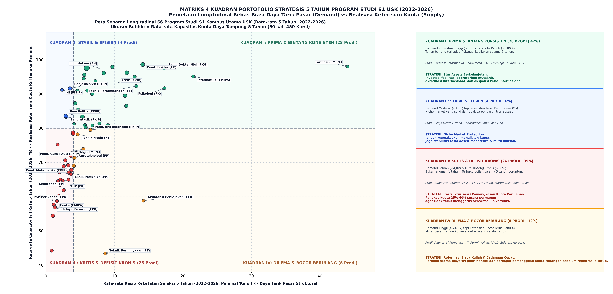

#### Komparasi Sebaran Portofolio: Snapshot 2026 vs Benchmark Longitudinal 5 Tahun (2022–2026)

| Kuadran Portofolio | Snapshot Tahun 2026 | Rata-rata 5 Tahun (2022–2026) | Perubahan Netto | Interpretasi Analitis Bebas Bias |
| :--- | :---: | :---: | :---: | :--- |
| **Kuadran I (Prima & Bintang)** | **31 Prodi** (47,0%) | **28 Prodi** (42,4%) | -3 Prodi | **Sangat Stabil:** Mayoritas star assets (Farmasi, Kedokteran, Informatika, Hukum, Psikologi, PGSD) memiliki daya tarik pasar struktural yang tidak goyah. |
| **Kuadran II (Stabil & Efisien)** | **6 Prodi** (9,1%) | **4 Prodi** (6,1%) | -2 Prodi | **Niche Market Solid:** Prodi seperti Hubungan Internasional, Ilmu Politik, Sendratasik, dan Penjaskesrek secara konsisten terisi penuh meski peminat moderat. |
| **Kuadran III (Kritis & Defisit)** | **22 Prodi** (33,3%) | **26 Prodi** (39,4%) | **+4 Prodi** | **BUKTI DEFISIT KRONIS:** Bertambahnya prodi kritis pada analisis 5 tahun membuktikan kursi kosong **bukan kecelakaan sesaat 2026**, melainkan kegagalan kapasitas kronis selama setengah dekade! |
| **Kuadran IV (Dilema & Kebocoran)** | **7 Prodi** (10,6%) | **8 Prodi** (12,1%) | +1 Prodi | **Kebocoran Konversi Struktural:** Peminat tinggi selalu ada setiap tahun, tetapi konversi daftar ulang konsisten rontok akibat kendala finansial/biaya Mandiri. |
| **TOTAL PRODI S1** | **66 Prodi** (100%) | **66 Prodi** (100%) | — | Seluruh 66 Program Studi S1 Kampus Utama USK. |

#### Temuan Kunci dari Analisis Longitudinal Bebas Bias:
1. **Pemberantasan Ilusi Pemulihan Semu:**
   * Beberapa prodi terlihat "membaik" di 2026, padahal secara riwayat 5 tahun berada di zona bahaya. Contoh nyata: **Teknik Perminyakan** di 2026 berada di Kuadran I (Fill Rate 86,7%), namun rata-rata 5 tahunnya hanya mencapai **43,4% (Kuadran IV)** karena di tahun-tahun awal sangat terpuruk.
   * **Arsitektur** di 2026 berada di Kuadran II (Fill Rate 81,9%), namun rata-rata 5 tahunnya berada di Kuadran III (Fill Rate 78,7%).
2. **Konfirmasi Defisit Akut di Sains Hayati & FKIP MIPA:**
   * Sebanyak **26 prodi (39,4%)** secara konsisten terbukti berada di Kuadran III selama 5 tahun berturut-turut (misal Budidaya Perairan, Fisika, PSP Perikanan, THP, Pend. Kimia, Pend. Fisika, Pend. Matematika).
   * Temuan ini memberikan dasar hukum dan manajerial yang **100% tak terbantahkan** bagi Rektorat untuk segera melakukan **rasionalisasi kuota permanen** pada SPMB 2027.

---


## BAB 7: DARI JALUR APA MAHASISWA MASUK? (ANALISIS JALUR PENERIMAAN & KEBOCORAN)

### 7.1 Dekomposisi Penerimaan Riil per Jalur Masuk (Snapshot Tahun 2026)

Untuk memahami pintu masuk mahasiswa baru ke Universitas Syiah Kuala dan membedah titik kebocoran calon mahasiswa yang lulus seleksi tetapi mengundurkan diri, berikut adalah profil penerimaan jalur masuk tahun 2026:

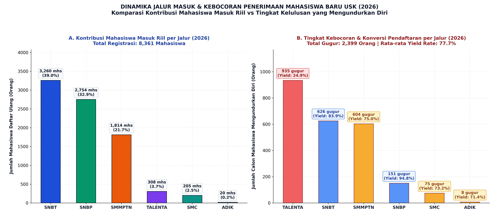

Berdasarkan data resmi 2026, total 8.361 mahasiswa baru USK terdistribusi ke dalam 6 pintu masuk:

| Jalur Penerimaan | Target Kuota Jalur | Calon Lulus Seleksi | Mahasiswa Daftar Ulang | Calon Mundur (Gugur) | Porsi Terhadap Total Mhs | Tingkat Konversi (Yield Rate) |
| :--- | :---: | :---: | :---: | :---: | :---: | :---: |
| **SNBT (Tes Nasional)** | 3.659 | 3.886 | **3.260** | 626 | **38,99%** | **83,89%** |
| **SNBP (Rapor Nasional)** | 3.136 | 2.905 | **2.754** | 151 | **32,94%** | **94,80%** |
| **SMMPTN (Mandiri Reguler)** | 3.660 | 2.418 | **1.814** | 604 | **21,70%** | **75,02%** |
| **TALENTA (Prestasi USK)**| — | 1.238 | **308** | **930** *(935 bruto)* | **3,68%** | **24,88%** |
| **Seleksi Cadangan (SMC)** | — | 280 | **205** | 75 | **2,45%** | **73,21%** |
| **ADIK (Afirmasi 3T)** | — | 28 | **20** | 8 | **0,24%** | **71,43%** |
| **TOTAL UNIVERSITAS** | **10.455** | **10.755** | **8.361** | **2.394** | **100,0%** | **77,74%** |

> **Catatan Rekonsiliasi Data Jalur TALENTA (Netto vs Bruto):**
> * **930 Orang (Netto Universitas):** Dihitung dari selisih langsung total kelulusan dikurangi total daftar ulang ($1.238 - 308 = 930$).
> * **935 Orang (Bruto Penjumlahan Kolom Pivot Table):** Diperoleh dari total penjumlahan kolom *Mundur/Gugur* per baris prodi. Terdapat selisih 5 orang karena di 4 program studi (Biologi, Teknik Geofisika, PPKn, dan Pendidikan Ekonomi), jumlah daftar ulang melebihi kuota kelulusan awal (+5 mahasiswa mutasi cadangan/afirmasi).

---

### 7.2 Rekapitulasi & Komparasi Historis Tahunan Jalur Masuk (2022 s.d. 2025)

Untuk melacak dinamika pembukaan jalur baru dan perubahan perilaku calon mahasiswa dari tahun ke tahun, telah dihasilkan visualisasi terstandarisasi untuk masing-masing tahun:

* [**Grafik Jalur Masuk 2022**](grafik/06_dinamika_jalur_masuk_dan_kebocoran_2022.png)
* [**Grafik Jalur Masuk 2023**](grafik/06_dinamika_jalur_masuk_dan_kebocoran_2023.png)
* [**Grafik Jalur Masuk 2024**](grafik/06_dinamika_jalur_masuk_dan_kebocoran_2024.png)
* [**Grafik Jalur Masuk 2025**](grafik/06_dinamika_jalur_masuk_dan_kebocoran_2025.png)

#### Tabel Rekapitulasi Komparasi Multi-Tahun Seluruh Jalur Masuk USK (2022–2026)

| Tahun | Jalur Penerimaan | Calon Lulus Seleksi | Mahasiswa Daftar Ulang | Calon Gugur (Mundur) | Pangsa Mahasiswa (Share %) | Tingkat Konversi (Yield Rate) |
| :---: | :--- | :---: | :---: | :---: | :---: | :---: |
| **2022** | **SNBT** | 3.518 | **3.049** | 469 | 49,2% | 86,7% |
| | **SNBP** | 1.982 | **1.869** | 113 | 30,2% | **94,3%** |
| | **SMMPTN (Mandiri)** | 1.928 | **1.279** | 649 | 20,6% | 66,3% |
| | *Total 2022* | *7.428* | ***6.197*** | *1.231* | *100,0%* | *83,4%* |
| **2023** | **SNBT** | 3.576 | **3.104** | 472 | 49,3% | 86,8% |
| | **SNBP** | 2.153 | **1.865** | 288 | 29,6% | 86,6% |
| | **SMMPTN (Mandiri)** | 1.973 | **1.330** | 643 | 21,1% | 67,4% |
| | *Total 2023* | *7.702* | ***6.299*** | *1.403* | *100,0%* | *81,8%* |
| **2024** | **SNBT** | 3.751 | **3.138** | 613 | 40,3% | 83,7% |
| | **SNBP** | 2.990 | **2.731** | 260 | 35,1% | 91,3% |
| | **SMMPTN (Mandiri)** | 2.401 | **1.631** | 770 | 20,9% | 67,9% |
| | **TALENTA** *(Baru)* | 197 | **174** | 23 | 2,2% | 88,3% |
| | **SMC** *(Baru)* | 136 | **104** | 32 | 1,3% | 76,5% |
| | **ADIK** *(Baru)* | 18 | **13** | 5 | 0,2% | 72,2% |
| | *Total 2024* | *9.493* | ***7.791*** | *1.703* | *100,0%* | *82,1%* |
| **2025** | **SNBT** | 3.811 | **3.261** | 551 | 40,6% | 85,6% |
| | **SNBP** | 2.930 | **2.664** | 266 | 33,2% | 90,9% |
| | **SMMPTN (Mandiri)** | 2.126 | **1.698** | 602 | 21,2% | 79,9% |
| | **TALENTA** | 307 | **208** | 99 | 2,6% | 67,8% |
| | **SMC** | 288 | **186** | 102 | 2,3% | 64,6% |
| | **ADIK** | 25 | **10** | 15 | 0,1% | 40,0% |
| | *Total 2025* | *9.487* | ***8.027*** | *1.635* | *100,0%* | *84,6%* |
| **2026** | **SNBT** | 3.886 | **3.260** | 626 | 39,0% | 83,9% |
| | **SNBP** | 2.905 | **2.754** | 151 | 32,9% | **94,8%** |
| | **SMMPTN (Mandiri)** | 2.418 | **1.814** | 604 | 21,7% | 75,0% |
| | **TALENTA** | 1.238 | **308** | **935** | 3,7% | **24,9% (CRASH)** |
| | **SMC** | 280 | **205** | 75 | 2,5% | 73,2% |
| | **ADIK** | 28 | **20** | 8 | 0,2% | 71,4% |
| | *Total 2026* | *10.755* | ***8.361*** | ***2.399*** | *100,0%* | *77,7%* |

---

### 7.3 Panorama Longitudinal Jalur Masuk & Eskalasi Kebocoran 5 Tahun (2022–2026)

Untuk memberikan analisis helikopter bagi pimpinan universitas, seluruh dinamika intake dan kebocoran selama 5 tahun disintesiskan ke dalam **Master Dashboard 3 Dimensi**:

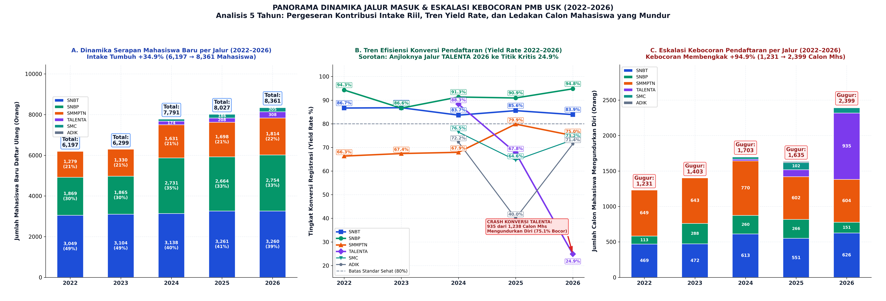

#### Tiga Wawasan Strategis Utama dari Dashboard 5 Tahun:

1. **Transformasi Komposisi Serapan Mahasiswa Baru (Panel A):**
   * Total mahasiswa baru yang mendaftar ulang di USK meningkat tajam sebesar **+34,9%**, dari 6.197 mahasiswa (2022) menjadi 8.361 mahasiswa (2026).
   * Terjadi diversifikasi pintu masuk pasca penetapan status PTN-BH: pada 2022–2023, USK hanya bergantung pada 3 pintu utama (SNBT 49%, SNBP 30%, Mandiri 21%). Mulai 2024, pintu alternatif dibuka (TALENTA, SMC, ADIK) yang menyumbang sekitar 6%–7% mahasiswa baru.
   * Dominasi SNBT menurun dari hampir 50% menjadi 39,0%, diimbangi peningkatan kapasitas jalur SNBP (naik dari 1.869 menjadi 2.754 mahasiswa).

2. **Jatuhnya Efisiensi Konversi Jalur TALENTA di Tahun 2026 (Panel B):**
   * Jalur **SNBP** konsisten menjadi jalur dengan komitmen pendaftaran ulang tertinggi di USK (Yield Rate selalu di kisaran 86,6%–94,8%). Aturan pemblokiran akun nasional bagi pelamar SNBP yang mangkir terbukti menjadi instrumen penegak disiplin yang sangat efektif.
   * Sebaliknya, terjadi **anomali keruntuhan konversi (*Conversion Crash*) pada Jalur TALENTA 2026**:
     * Pada 2024 (tahun perdana), Yield Rate TALENTA mencapai **88,3%** (hanya 23 orang gugur).
     * Pada 2025, Yield Rate mulai turun ke **67,8%** (99 orang gugur).
     * Pada 2026, universitas meluluskan calon mahasiswa TALENTA secara masif (1.238 orang), namun yang daftar ulang hanya 308 orang. **Sebanyak 935 orang (75,1%) mengundurkan diri**, menjatuhkan Yield Rate ke titik nadir **24,9%**!

3. **Pembengkakan Angka Kebocoran Calon Mahasiswa (+94,9% dalam 5 Tahun) (Panel C):**
   * Jumlah calon mahasiswa yang lulus seleksi tetapi tidak mendaftar ulang membengkak drastis dari **1.231 orang pada 2022** menjadi **2.399 orang pada 2026** (hampir dua kali lipat!).
   * Jika pada tahun 2022–2023 kebocoran didominasi oleh SMMPTN Mandiri (akibat faktor biaya IPI), pada tahun 2026 **Jalur TALENTA menjadi episentrum kebocoran terbesar (935 orang)**, melampaui kebocoran jalur tes SNBT (626 orang) dan SMMPTN (604 orang).

---

### 7.4 Analisis Akar Masalah & Solusi Tata Kelola Pendaftaran Ulang

1. **Akar Masalah Kebocoran Jalur TALENTA (75% Mangkir):**
   * Seleksi TALENTA dilaksanakan lebih awal tanpa membebankan biaya registrasi yang mengikat atau uang muka komitmen (*commitment deposit*). Akibatnya, ribuan siswa berprestasi menjadikan pengumuman TALENTA hanya sebagai "tiket cadangan gratis" sambil menunggu hasil pengumuman UTBK-SNBT atau tes perguruan tinggi kedinasan. Begitu mereka diterima di jalur nasional/kedinasan, tiket TALENTA langsung dilepas begitu saja.
   * **Rekomendasi Kebijakan:** Terapkan skema *Commitment Fee* atau *Early Registration Deposit* (misal Rp500.000 s.d. Rp1.000.000 yang langsung memotong biaya UKT semester 1) saat calon mahasiswa mengklaim kelulusan TALENTA.

2. **Akar Masalah Kebocoran Jalur SMMPTN Mandiri (25% Gugur):**
   * Calon mahasiswa mandiri dihadapkan pada tenggat pembayaran uang pangkal IPI yang sangat sempit (5–7 hari kalender) setelah pengumuman kelulusan. Keluarga dengan likuiditas terbatas mengalami syok finansial dan terpaksa merelakan kursi tersebut.
   * **Rekomendasi Kebijakan:** Buka fasilitas *Cicilan IPI 3 Tahap* otomatis bagi mahasiswa baru jalur mandiri dan percepat pemanggilan kuota cadangan (*waitlist*) sebelum sistem registrasi nasional ditutup.

---

## BAB 8: EKSPLORASI KAUSALITAS LAPANGAN: FAKTA DATA VS TEMUAN DESK RESEARCH

Sesuai catatan khusus pada halaman 1 dan butir 13 dokumen `TUGAS 05 - MAGANG (KHUSUS).pdf`, analisis ini **membedakan secara tegas** antara bukti fakta data angka dan temuan desk research lapangan:

```
                  MATRIKS PEMISAHAN FAKTA DATA VS TEMUAN LAPANGAN
  ┌─────────────────────────────────┐               ┌─────────────────────────────────┐
  │   [FAKTA DATA EMPIRIS RESMI]    │               │   [TEMUAN DESK RESEARCH / HIPO] │
  │ Angka terukur dari database:    │──────────────>│ Kausalitas lapangan pendukung:  │
  │ Tabel Peminat, DT, DU, Yield    │               │ Pasar kerja, regulasi, UKT/IPI. │
  └─────────────────────────────────┘               └─────────────────────────────────┘
```

### 8.1 Matriks Kausalitas Program Studi Kunci

| Program Studi | [FAKTA DATA EMPIRIS RESMI] | [TEMUAN DESK RESEARCH & KAUSALITAS LAPANGAN] |
| :--- | :--- | :--- |
| **PGSD (FKIP)** | Mahasiswa daftar ulang naik +106% (105 ke 217 mhs), 4 tahun naik beruntun, keterisian 108%. | **Faktor Formasi PPPK:** Kebijakan pemerintah pusat dan Pemda di Aceh membuka ribuan formasi guru SD negeri lewat skema PPPK, menciptakan kepastian karir langsung pasca lulus. |
| **Ilmu Keperawatan** | Daftar ulang melompat +132% (127 ke 295 mhs), kuota dinaikkan dari 160 ke 360 kursi dan terserap 82%. | **Faktor Pasar Ners Global:** Program penempatan perawat Indonesia ke luar negeri (khususnya program G-to-G ke Jepang dan Jerman dengan gaji tinggi) menjadi magnet pendaftar internasional. |
| **Teknik Komputer** | Pendaftar naik dari 85 ke 145 mhs, rasio keketatan seleksi 18,1 : 1. | **Faktor Kebutuhan Industri Digital:** Tren digitalisasi, IoT, dan otomasi industri mendorong tingginya minat generasi muda pada rekayasa perangkat keras dan jaringan komputer. |
| **Manajemen (FEB)** | Pendaftar merosot 3 tahun beruntun dari 266 ke 199 mhs (-25%). | **Faktor Kanibalisasi Internal & Jenuh:** Dibukanya prodi baru *S1 Bisnis Digital* di FEB pada 2024 menyedot langsung calon mahasiswa Manajemen, ditambah menjamurnya prodi manajemen di PTS lokal. |
| **Budidaya Perairan** | Peminat hanya 145 orang untuk 160 kursi (keketatan < 1:1), pendaftar ulang macet di 90 orang. | **Faktor Persepsi Karir Agromaritim:** Persepsi minimnya prospek kerja kantoran di instansi daerah dan kurang populernya sektor perikanan budidaya di mata lulusan SMA perkotaan. |
| **Fisika (FMIPA)** | Peminat hanya 94 orang untuk 80 kuota, keterisian kuota 5 tahun rata-rata hanya 44,2%. | **Faktor Kurikulum Sains Murni:** Jurusan sains murni dipersepsikan memiliki tingkat kesulitan akademik tinggi namun minim formasi lowongan kerja korporasi di daerah Aceh. |
| **Jalur Mandiri** | 604 calon mahasiswa lulus (25%) mengundurkan diri pada tahun 2026. | **Beban Finansial IPI (SK Rektor 1162/2026):** Tagihan uang pangkal IPI berkisar Rp10.000.000 s.d. Rp35.000.000 yang wajib dibayar dalam 5–7 hari kerja memicu *liquidity shock* keluarga menengah-bawah. |
| **Jalur TALENTA** | 930 calon mahasiswa lulus (75%) mengundurkan diri pada tahun 2026. | **Perilaku Spekulatif Pendaftar:** Pendaftaran jalur prestasi tidak membebankan biaya hangus, sehingga siswa menjadikannya cadangan gratis sambil menunggu pengumuman UTBK. |

---

## BAB 9: EVALUASI KINERJA 12 FAKULTAS S1 & KLASTER KHUSUS (D3 & PSDKU)

### 9.1 Evaluasi Daya Serap, Volatilitas 5 Tahun, & Beban Kursi Kosong 12 Fakultas S1

Untuk mengevaluasi kinerja fakultas di kampus utama, analisis membedah efisiensi keterisian kuota dari dua sudut pandang: **perbandingan snapshot (2022 vs 2026)** dan **lintasan tren longitudinal 5 tahun (2022–2026)**:

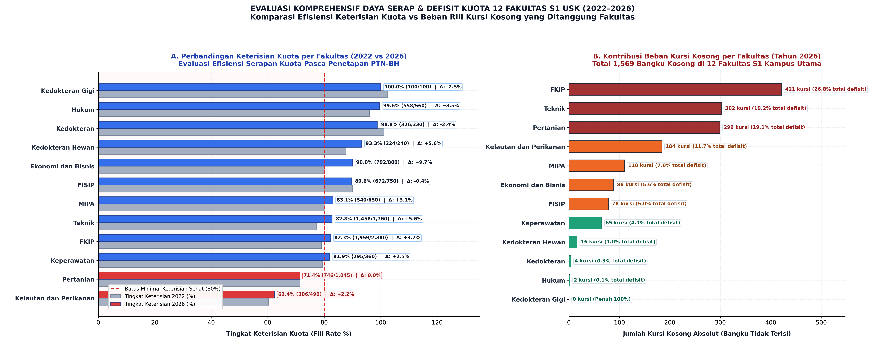

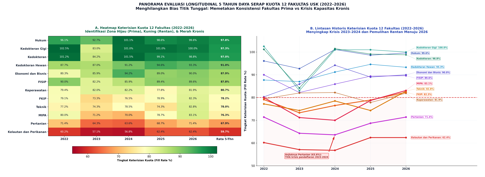

#### Tabel Kinerja Komparatif 12 Fakultas S1 Kampus Utama USK (2022–2026)

| Fakultas S1 | Keterisian 2022 (%) | Keterisian 2026 (%) | Delta (2026 vs 2022) | Rata-rata Keterisian 5-Thn | Sisa Kursi Kosong 2026 | Pangsa Defisit Kampus | Status Kesehatan Portofolio |
| :--- | :---: | :---: | :---: | :---: | :---: | :---: | :--- |
| **Kedokteran Gigi (FKG)** | 102,5% | **100,0%** | -2,5% | **97,3%** | **0 Kursi** | 0,0% | **Prima (Zero Deficit)** |
| **Hukum (FH)** | 96,1% | **99,6%** | +3,5% | **97,8%** | **2 Kursi** | 0,1% | **Prima (Sangat Stabil)** |
| **Kedokteran (FK)** | 101,2% | **98,8%** | -2,4% | **97,0%** | **4 Kursi** | 0,3% | **Prima (Kompetitif)** |
| **Kedokteran Hewan (FKH)** | 87,7% | **93,3%** | +5,6% | **91,0%** | **16 Kursi** | 1,0% | **Sehat Konsisten** |
| **Ekonomi & Bisnis (FEB)** | 80,3% | **90,0%** | +9,7% | **87,9%** | **88 Kursi** | 5,6% | **Sehat Tumbuh** |
| **FISIP** | 90,0% | **89,6%** | -0,4% | **87,8%** | **78 Kursi** | 5,0% | **Sehat Stabil** |
| **MIPA (FMIPA)** | 80,0% | **83,1%** | +3,1% | **76,3%** | **110 Kursi** | 7,0% | *Rentan (Rata-rata 5-Thn < 80%)* |
| **Teknik (FT)** | 77,2% | **82,8%** | +5,6% | **78,0%** | **302 Kursi** | **19,2%** | *Raksasa Rentan (Defisit Masif)* |
| **FKIP** | 79,1% | **82,3%** | +3,2% | **78,2%** | **421 Kursi** | **26,8%** | *Raksasa Rentan (Episentrum Defisit)* |
| **Keperawatan (FKep)** | 79,4% | **81,9%** | +2,5% | **80,7%** | **65 Kursi** | 4,1% | **Sehat Moderat** |
| **Pertanian (FP)** | 71,4% | **71,4%** | **0,0%** | **67,9%** | **299 Kursi** | **19,1%** | **Krisis Kronis (Dip 63,6% di 2024)** |
| **Kelautan & Perikanan (FPK)**| 60,2% | **62,4%** | +2,2% | **59,7%** | **184 Kursi** | **11,7%** | **Kritis Akut (5 Tahun < 65%)** |
| **TOTAL KAMPUS UTAMA** | **80,8%** | **84,2%** | **+3,4%** | **81,4%** | **1.569 Kursi** | **100,0%** | **Batas Sehat Terlampaui Tipis** |

#### Tiga Temuan Kritis Kinerja Fakultas:

1. **Ilusi Kestabilan pada Fakultas Pertanian (Kelemahan Fatal Analisis 2 Titik):**
   * Jika analis hanya membandingkan tahun 2022 (71,4%) dengan tahun 2026 (71,4%), kesimpulan yang ditarik adalah *"Fakultas Pertanian stabil tanpa perubahan"*.
   * **Fakta Melalui Lintasan 5 Tahun:** Pertanian sebenarnya mengalami guncangan krisis hebat pada tahun 2023 (64,3%) dan 2024 (63,6%), sebelum perlahan merangkak kembali ke 71,4%. Rata-rata 5 tahun Pertanian hanya **67,9%**, membuktikan adanya masalah struktural peminat yang belum terselesaikan.
2. **Episentrum Bangku Kosong Terkonsentrasi pada 3 Fakultas (1.022 Kursi Kosong):**
   * Meskipun FKIP dan Teknik berhasil melampaui batas keterisian sehat 80% pada tahun 2026 (masing-masing 82,3% dan 82,8%), **keduanya merupakan penyumbang kursi kosong terbesar di universitas**.
   * FKIP mencatatkan **421 kursi kosong (26,8% total defisit)** dan Teknik mencatatkan **302 kursi kosong (19,2% total defisit)**. Bersama Pertanian (299 kursi), ketiga fakultas ini menampung **65,1% dari seluruh bangku kosong di kampus utama S1 USK**!
3. **Zona Merah Permanen Fakultas Kelautan & Perikanan (FPK):**
   * FPK adalah satu-satunya fakultas di USK yang selama 5 tahun berturut-turut tidak pernah mampu mencapai angka keterisian 65% (rata-rata 5 tahun hanya 59,7%). Tingkat keketatan seleksinya sangat rendah (1,42 : 1), mengindikasikan bahwa hampir semua pendaftar otomatis diterima namun tetap tidak mampu memenuhi kuota.

---

### 9.2 Diagnostik Mendalam Tingkat Program Studi S1: Menembus Akar Masalah 1.569 Kursi Kosong

Analisis tingkat fakultas memberikan gambaran makro, namun **tingkat program studi adalah tempat di mana keputusan alokasi kuota riil dieksekusi**. Melalui evaluasi 66 program studi S1 di kampus utama, terungkap bahwa krisis bangku kosong USK mengikuti **Prinsip Pareto (Aturan 80/20)** secara nyata:

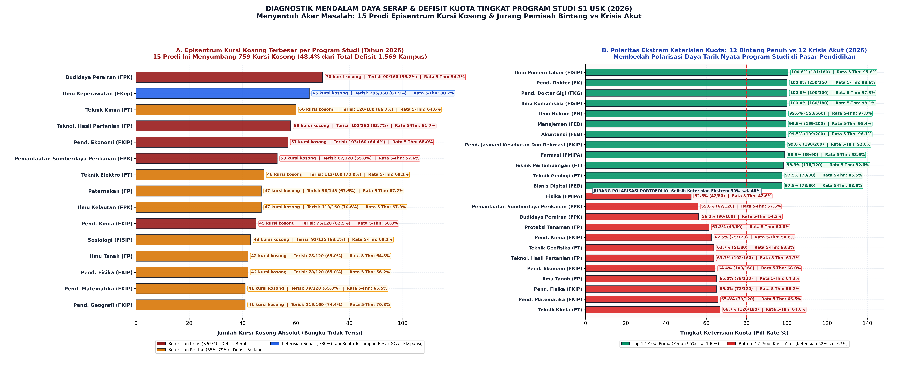

#### 1. Episentrum Defisit Bangku Kosong: 15 Program Studi Menyerap 48,4% Kursi Kosong USK

Dari total 1.569 kursi kosong di jenjang Sarjana (S1) Kampus Utama pada tahun 2026, sebanyak **759 kursi kosong (48,4% atau hampir separuh defisit kampus)** terkonsentrasi hanya pada **15 program studi (22,7% dari total prodi)** berikut:

| No | Program Studi S1 | Fakultas | Daya Tampung 2026 | Daftar Ulang 2026 | Kursi Kosong (Defisit) | Keterisian 2026 (%) | Rata-rata Keterisian 5-Thn | Diagnosis Akar Masalah |
| :-: | :--- | :---: | :---: | :---: | :---: | :---: | :---: | :--- |
| 1 | **Budidaya Perairan** | FPK | 160 | 90 | **70 Kursi** | 56,2% | 54,3% | *Krisis Minat Kronis (5 Thn <55%)* |
| 2 | **Ilmu Keperawatan** | FKep | 360 | 295 | **65 Kursi** | 81,9% | 80,7% | *Over-Ekspansi Kuota Masif (160 ke 360)* |
| 3 | **Teknik Kimia** | FT | 180 | 120 | **60 Kursi** | 66,7% | 64,6% | *Kuota Terlampau Besar vs Minat Industri Lokal* |
| 4 | **Teknologi Hasil Pertanian**| FP | 160 | 102 | **58 Kursi** | 63,7% | 61,7% | *Defisit Serapan Kronis* |
| 5 | **Pendidikan Ekonomi** | FKIP | 160 | 103 | **57 Kursi** | 64,4% | 68,0% | *Kelebihan Pasokan Guru di Pasar Daerah* |
| 6 | **Pemanfaatan Sumberdaya Perikanan** | FPK | 120 | 67 | **53 Kursi** | 55,8% | 57,6% | *Stigma Lapangan Berat & Minat Pendaftar Rendah* |
| 7 | **Teknik Elektro** | FT | 160 | 112 | **48 Kursi** | 70,0% | 68,1% | *Target Kuota Terlalu Agresif* |
| 8 | **Ilmu Kelautan** | FPK | 160 | 113 | **47 Kursi** | 70,6% | 67,3% | *Rasio Konversi Rendah di Jalur Akhir* |
| 9 | **Peternakan** | FP | 145 | 98 | **47 Kursi** | 67,6% | 67,7% | *Stagnasi Pasar Peminat Tradisional* |
| 10 | **Pendidikan Kimia** | FKIP | 120 | 75 | **45 Kursi** | 62,5% | 58,8% | *Kejenuhan Serapan Guru Sains di Sekolah* |
| 11 | **Sosiologi** | FISIP | 135 | 92 | **43 Kursi** | 68,1% | 69,1% | *Kalah Bersaing dengan Komunikasi/Ilmu Pem.* |
| 12 | **Ilmu Tanah** | FP | 120 | 78 | **42 Kursi** | 65,0% | 64,3% | *Persepsi Karir Kurang Menjanjikan* |
| 13 | **Pendidikan Fisika** | FKIP | 120 | 78 | **42 Kursi** | 65,0% | 56,2% | *Krisis Minat Pendaftar Ilmu Dasar Sains* |
| 14 | **Pendidikan Matematika** | FKIP | 120 | 79 | **41 Kursi** | 65,8% | 66,5% | *Target Kuota Tidak Realistis* |
| 15 | **Pendidikan Geografi** | FKIP | 160 | 119 | **41 Kursi** | 74,4% | 70,3% | *Kapasitas Kelas Terlalu Lebar* |
| - | **TOTAL 15 PRODI EPISENTRUM** | - | **2.405** | **1.646** | **759 Kursi** | **68,4%** | **66,2%** | **Menyumbang 48,4% Total Kursi Kosong USK** |

#### 2. Polarisasi Ekstrem: Fenomena Dua Dunia di Bawah Satu Kampus

Grafik diagnostik panel B mengungkap **jurang pemisah polarisasi yang sangat tajam (*Severe Portfolio Bipolarity*)**:

* **Kelompok 12 Bintang Prima (Keterisian 95% s.d. 100%):**
  * Didominasi oleh program studi dengan *brand image* kuat dan kepastian pasar kerja tinggi:
    1. *Ilmu Pemerintahan* (100,6%) & *Ilmu Komunikasi* (100,0%) di FISIP.
    2. *Pendidikan Dokter Gigi* (100,0%) & *Pendidikan Dokter* (100,0%).
    3. *Ilmu Hukum* (99,6% - terisi 558 dari 560 kursi).
    4. *Manajemen* (99,5%) & *Akuntansi* (99,5%) di FEB.
    5. *Penjaskesrek* di FKIP (99,0%).
    6. *Farmasi* (98,9%), *Informatika* (97,5%), *Teknik Pertambangan* (98,3%), dan *Bisnis Digital* (97,5%).
* **Kelompok 12 Krisis Akut (Keterisian 52% s.d. 67%):**
  * Berada di kutub sebaliknya, di mana hampir separuh kursi yang disiapkan berakhir mubazir:
    1. **Fisika Murni (FMIPA):** Terisi hanya **52,5% (42 dari 80 kursi)** dengan rata-rata 5 tahun terburuk di USK (**42,6%**).
    2. **Pemanfaatan Sumberdaya Perikanan (FPK):** Terisi **55,8%** (rata-rata 5 tahun 57,6%).
    3. **Budidaya Perairan (FPK):** Terisi **56,2%** (rata-rata 5 tahun 54,3%).
    4. **Proteksi Tanaman (FP):** Terisi **61,3%** (rata-rata 5 tahun 60,0%).
    5. **Pendidikan Kimia & Pendidikan Fisika (FKIP):** Masing-masing terisi **62,5%** dan **65,0%**.
    6. **Teknik Geofisika (FT) & Teknologi Hasil Pertanian (FP):** Terisi **63,7%**.

#### 3. Mengapa Analisis Fakultas Menutupi Akar Masalah? (*Intra-Faculty Disparity*)

Data program studi membuktikan bahwa **analisis agregat tingkat fakultas sering kali menyembunyikan luka parah di tingkat prodi**:
1. **Di Fakultas Teknik (FT):** Tingkat keterisian fakultas tampak memuaskan (**82,8%**). Namun, angka ini terdongkrak oleh Teknik Pertambangan (98,3%), Teknik Geologi (97,5%), dan Arsitektur (95,0%). Di balik itu, **Teknik Kimia terdampar dengan 60 kursi kosong (66,7%)** dan Teknik Geofisika berada di angka 63,7%!
2. **Di FMIPA:** Keterisian fakultas mencapai **83,1%**, berkat Farmasi (98,9%) dan Informatika (97,5%). Namun **Fisika Murni mengalami krisis eksistensial akut dengan keterisian hanya 52,5%**!
3. **Di FKIP:** Penjaskesrek (99,0%) dan Bimbingan Konseling (96,7%) sangat diminati, namun FKIP secara keseluruhan menanggung 421 kursi kosong karena prodi-prodi sains keguruan (Pend. Kimia, Fisika, Matematika) mengalami penolakan pasar.

---

#### 4. Panorama Longitudinal 5 Tahun Kinerja Program Studi (2022–2026): Menyingkap Penyakit Kronis Setengah Dekade

Untuk menguji apakah anomali tahun 2026 merupakan peristiwa temporer atau defisit struktural permanen, analisis diperluas mencakup **seluruh lintasan 5 tahun (2022–2026)**:

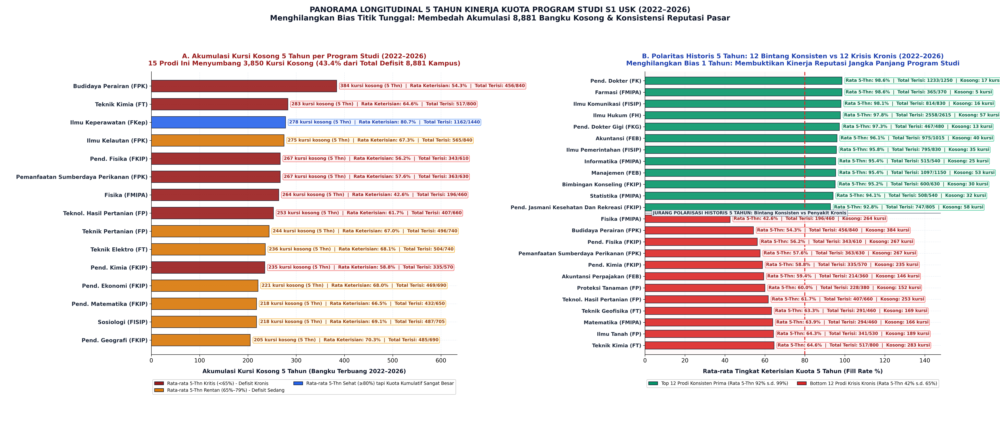

##### A. Akumulasi 8.881 Kursi Kosong: 15 Program Studi Menyerap 3.850 Kursi (43,4%)

Sepanjang 2022 hingga 2026, universitas mengakumulasi sebanyak **8.881 bangku kosong** di jenjang S1 Kampus Utama. Sebanyak **3.850 kursi kosong (43,4%)** terkonsentrasi hanya pada 15 program studi berikut:

| No | Program Studi S1 | Fakultas | Total Daya Tampung (5-Thn) | Total Mahasiswa Masuk (5-Thn) | Akumulasi Kursi Kosong (5-Thn) | Pangsa Defisit Kampus | Rata-rata Keterisian 5-Thn | Status Evaluasi 5 Tahun |
| :-: | :--- | :---: | :---: | :---: | :---: | :---: | :---: | :--- |
| 1 | **Budidaya Perairan** | FPK | 840 Kursi | 456 Mhs | **384 Kursi** | **4,3%** | **54,3%** | **Krisis Akut Terburuk** |
| 2 | **Teknik Kimia** | FT | 800 Kursi | 517 Mhs | **283 Kursi** | **3,2%** | **64,6%** | **Defisit Kronis Stabil** |
| 3 | **Ilmu Keperawatan** | FKep | 1.440 Kursi | 1.162 Mhs | **278 Kursi** | **3,1%** | **80,7%** | *Over-Ekspansi Kuota Besar* |
| 4 | **Ilmu Kelautan** | FPK | 840 Kursi | 565 Mhs | **275 Kursi** | **3,1%** | **67,3%** | *Defisit Serapan Tinggi* |
| 5 | **Pendidikan Fisika** | FKIP | 610 Kursi | 343 Mhs | **267 Kursi** | **3,0%** | **56,2%** | **Krisis Minat Kronis** |
| 6 | **Pemanfaatan Sumberdaya Perikanan**| FPK | 630 Kursi | 363 Mhs | **267 Kursi** | **3,0%** | **57,6%** | **Krisis Minat Kronis** |
| 7 | **Fisika Murni** | FMIPA | 460 Kursi | 196 Mhs | **264 Kursi** | **3,0%** | **42,6%** | **Keterisian Terendah Se-USK** |
| 8 | **Teknologi Hasil Pertanian** | FP | 660 Kursi | 407 Mhs | **253 Kursi** | **2,8%** | **61,7%** | **Defisit Kronis Stabil** |
| 9 | **Teknik Pertanian** | FP | 740 Kursi | 496 Mhs | **244 Kursi** | **2,7%** | **67,0%** | *Defisit Sedang Berulang* |
| 10 | **Teknik Elektro** | FT | 740 Kursi | 504 Mhs | **236 Kursi** | **2,7%** | **68,1%** | *Target Kuota Agresif* |
| 11 | **Pendidikan Kimia** | FKIP | 570 Kursi | 335 Mhs | **235 Kursi** | **2,6%** | **58,8%** | **Krisis Minat Kronis** |
| 12 | **Pendidikan Ekonomi** | FKIP | 690 Kursi | 469 Mhs | **221 Kursi** | **2,5%** | **68,0%** | *Defisit Sedang Berulang* |
| 13 | **Pendidikan Matematika** | FKIP | 650 Kursi | 432 Mhs | **218 Kursi** | **2,5%** | **66,5%** | *Defisit Sedang Berulang* |
| 14 | **Sosiologi** | FISIP | 705 Kursi | 487 Mhs | **218 Kursi** | **2,5%** | **69,1%** | *Defisit Sedang Berulang* |
| 15 | **Teknik Sipil** | FT | 1.235 Kursi | 1.030 Mhs | **205 Kursi** | **2,3%** | **83,4%** | *Skala Kapasitas Sangat Besar* |
| - | **TOTAL 15 PRODI AKUMULASI** | - | **11.615 Kursi** | **7.765 Mhs** | **3.850 Kursi** | **43,4%** | **66,9%** | **Episentrum Bangku Kosong 5 Tahun** |

##### B. Perbandingan Dua Kutub Reputasi Historis (5 Tahun Berturut-turut)

1. **Kelompok Bintang Prima Konsisten (Rata-rata 5 Tahun 92% s.d. 99%):**
   * Program studi ini membuktikan daya tahan pasar yang luar biasa tanpa pernah sekalipun mengalami defisit kursi berarti dalam 5 tahun:
     * *Pendidikan Dokter (FK):* Rata-rata 5 tahun **98,6%** (hanya 17 kursi kosong dalam 5 tahun dari 1.250 kuota).
     * *Farmasi (FMIPA):* Rata-rata 5 tahun **98,6%** (hanya 5 kursi kosong dalam 5 tahun).
     * *Ilmu Komunikasi (FISIP):* Rata-rata 5 tahun **98,1%** (hanya 16 kursi kosong dalam 5 tahun).
     * *Ilmu Hukum (FH):* Rata-rata 5 tahun **97,8%** (menyerap 2.558 mahasiswa dari 2.615 kuota).
     * *Pendidikan Dokter Gigi (FKG):* Rata-rata 5 tahun **97,3%**.
     * *Akuntansi (FEB) & Manajemen (FEB):* Masing-masing **96,1%** dan **95,4%**.
     * *Ilmu Pemerintahan (FISIP) & Informatika (FMIPA):* Masing-masing **95,8%** dan **95,4%**.
     * *Bimbingan Konseling (FKIP):* Rata-rata 5 tahun **95,2%**.
     * *Statistika (FMIPA) & Penjaskesrek (FKIP):* Masing-masing **94,1%** dan **92,8%**.
2. **Kelompok Krisis Kronis Permanen (Rata-rata 5 Tahun 42% s.d. 65%):**
   * Data 5 tahun membuktikan secara mutlak bahwa program studi ini **mengalami penolakan pasar yang bersifat sistemik**, bukan insidental:
     * **Fisika Murni (FMIPA):** Selama 5 tahun rata-rata hanya **42,6%** (2022: 46,7%, 2023: 40,0%, 2024: 25,8%, 2025: 56,2%, 2026: 52,5%). Keterisian di bawah 50% adalah sinyal darurat penataan kurikulum.
     * **Budidaya Perairan (FPK):** Rata-rata 5 tahun hanya **54,3%** (5 tahun berturut-turut di kisaran 50%–61%).
     * **Pendidikan Fisika (FKIP):** Rata-rata 5 tahun hanya **56,2%** (sempat anjlok ke 49,4% di 2024).
     * **Pemanfaatan Sumberdaya Perikanan (FPK):** Rata-rata 5 tahun hanya **57,6%**.
     * **Pendidikan Kimia (FKIP):** Rata-rata 5 tahun hanya **58,8%**.
     * **Proteksi Tanaman (FP) & Teknologi Hasil Pertanian (FP):** Masing-masing **60,0%** dan **61,7%**.
     * **Teknik Geofisika (FT) & Teknik Kimia (FT):** Masing-masing **63,3%** dan **64,6%**.

---

### 9.3 Krisis Eksistensial 11 Program Studi Diploma 3 (Vokasi)

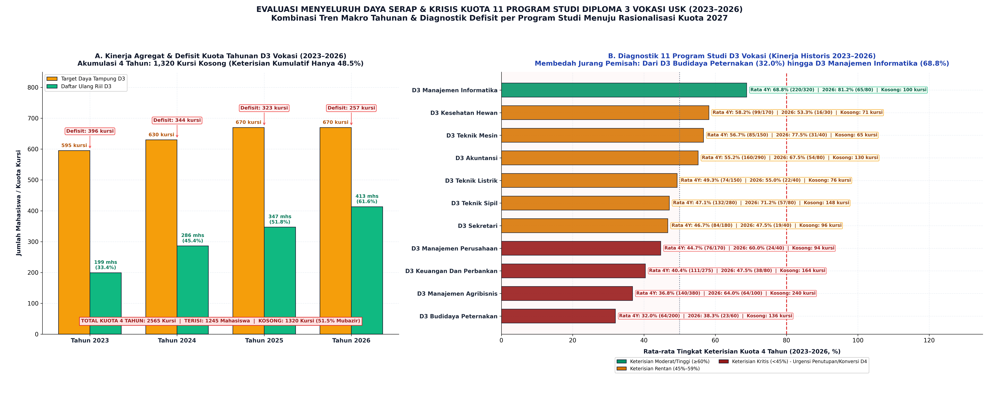

#### 1. Kinerja Agregat Makro D3 Vokasi (2023–2026)

Evaluasi multi-tahun 11 program studi D3 di lingkungan USK sepanjang 2023–2026 (sejak terintegrasi ke dalam sistem seleksi nasional):

| Tahun Akademik | Target Daya Tampung D3 | Mahasiswa Daftar Ulang Riil | Kursi Kosong (Defisit) | Tingkat Keterisian Kuota (%) |
| :---: | :---: | :---: | :---: | :---: |
| **2023** | 595 Kursi | **199 Mahasiswa** | 396 Kursi Kosong | **33,4%** |
| **2024** | 630 Kursi | **286 Mahasiswa** | 344 Kursi Kosong | **45,4%** |
| **2025** | 670 Kursi | **347 Mahasiswa** | 323 Kursi Kosong | **51,8%** |
| **2026** | 670 Kursi | **413 Mahasiswa** | 257 Kursi Kosong | **61,6%** |
| **TOTAL 4 TAHUN** | **2.565 Kursi** | **1.245 Mahasiswa** | **1.320 Kursi Kosong** | **48,5% (Kumulatif)** |

* **Fakta Akumulasi:** Dalam rentang 4 tahun, USK membuka sebanyak 2.565 kursi untuk jenjang D3, namun hanya berhasil menjaring 1.245 mahasiswa. Artinya, **1.320 bangku (51,5% atau lebih dari separuh kuota yang dibuka) berakhir terbuang sia-sia**.
* Meskipun terdapat tren pemulihan persentase (dari 33,4% di 2023 menjadi 61,6% di 2026), keterisian di angka 61% masih berada jauh di bawah ambang batas kelayakan ekonomi kelas perguruan tinggi (minimal 80%).

#### 2. Diagnostik Terperinci 11 Program Studi D3 Vokasi (Kinerja Historis 2023–2026)

Evaluasi granular per program studi menyingkap disparitas yang sangat tajam di antara 11 prodi diploma:

| No | Program Studi D3 | Total Kuota (4-Thn) | Total Masuk (4-Thn) | Akumulasi Kursi Kosong | Rata Keterisian 4-Thn (%) | Keterisian 2026 (%) | Status & Rekomendasi Kebijakan |
| :-: | :--- | :---: | :---: | :---: | :---: | :---: | :--- |
| 1 | **D3 Budidaya Peternakan** | 200 | 64 | **136 Kursi** | **32,0%** | 38,3% (23/60) | **Krisis Kritis — Urgensi Evaluasi Eksistensi** |
| 2 | **D3 Manajemen Agribisnis** | 380 | 140 | **240 Kursi** | **36,8%** | 64,0% (64/100) | **Defisit Bangku Terbesar di Vokasi** |
| 3 | **D3 Keuangan dan Perbankan**| 275 | 111 | **164 Kursi** | **40,4%** | 47,5% (38/80) | **Kritis — Kalah Saing dengan S1 FEB** |
| 4 | **D3 Manajemen Perusahaan** | 170 | 76 | **94 Kursi** | **44,7%** | 60,0% (24/40) | *Rentan — Skala Kelas Terlalu Kecil* |
| 5 | **D3 Sekretari** | 180 | 84 | **96 Kursi** | **46,7%** | 47,5% (19/40) | *Rentan — Relevansi Profesi Tergerus Digitalisasi* |
| 6 | **D3 Teknik Sipil** | 280 | 132 | **148 Kursi** | **47,1%** | 71,2% (57/80) | *Potensial Konversi ke D4 Sarjana Terapan* |
| 7 | **D3 Teknik Listrik** | 150 | 74 | **76 Kursi** | **49,3%** | 55,0% (22/40) | *Rentan — Peminat Terbatas* |
| 8 | **D3 Akuntansi** | 290 | 160 | **130 Kursi** | **55,2%** | 67,5% (54/80) | *Cukup Stabil — Perlu Diferensiasi Terapan* |
| 9 | **D3 Teknik Mesin** | 150 | 85 | **65 Kursi** | **56,7%** | 77,5% (31/40) | *Membaik Cepat di 2026 — Pertahankan Kuota Kecil* |
| 10 | **D3 Kesehatan Hewan** | 170 | 99 | **71 Kursi** | **58,2%** | 53,3% (16/30) | *Spesialisasi Unik — Perlu Penguatan Kemitraan* |
| 11 | **D3 Manajemen Informatika** | 320 | 220 | **100 Kursi** | **68,8%** | **81,2% (65/80)** | **Bintang Vokasi — Sehat & Menembus Target >80%** |
| - | **TOTAL DIPLOMA 3** | **2.565** | **1.245** | **1.320 Kursi** | **48,5%** | **61,6% (413/670)** | **Evaluasi Menyeluruh Portofolio Vokasi** |

#### 3. Tiga Akar Masalah Struktural Mengapa Peminat D3 Vokasi Anjlok

1. **Disinsentif Regulasi Karir Kepegawaian (ASN & BUMN):**
   * Berdasarkan regulasi BKN dan KemenPAN-RB, lulusan Diploma 3 yang lulus seleksi CPNS masuk dengan kualifikasi **Golongan Ruang II/c**.
   * Sebaliknya, lulusan Sarjana Terapan (D4) dan Sarjana Akademik (S1) langsung berhak menyandang **Golongan Ruang III/a**. 
   * Disparitas jenjang kepangkatan dan *remunerasi* ini membuat calon mahasiswa dan orang tua menganggap D3 sebagai jenjang yang "tanggung" dan merugikan secara investasi waktu.
2. **Ketiadaan Diferensiasi dengan Kurikulum S1:**
   * Sebagian besar prodi D3 di USK masih diselenggarakan di bawah fakultas akademik yang sama dengan S1 (bukan di bawah Politeknik/Sekolah Vokasi mandiri dengan laboratorium workshop terdedikasi). Akibatnya, kurikulum D3 sering kali hanya berupa "versi ringkas" dari S1, tanpa keunggulan kompetensi praktis bersertifikasi industri yang nyata.
3. **Solusi Strategis: Transformasi / Upgrading Menuju D4 Sarjana Terapan:**
   * USK disarankan melakukan restrukturisasi menyeluruh: mengonversi program D3 yang potensial (seperti Teknik Sipil, Manajemen Informatika, dan Akuntansi) menjadi **Sarjana Terapan (D4)** dengan kurikulum *dual system* (magang industri 1 tahun penuh).
   * Untuk prodi D3 dengan keterisian kronis di bawah 40% (seperti Budidaya Peternakan dan Manajemen Agribisnis), perlu dilakukan moratorium atau pemangkasan kuota drastis agar tidak menguras anggaran operasional fakultas.

---

### 9.4 Sub-Analisis PSDKU Gayo Lues: Anomali Geografis & Krisis Kampus Cabang (2022–2026)

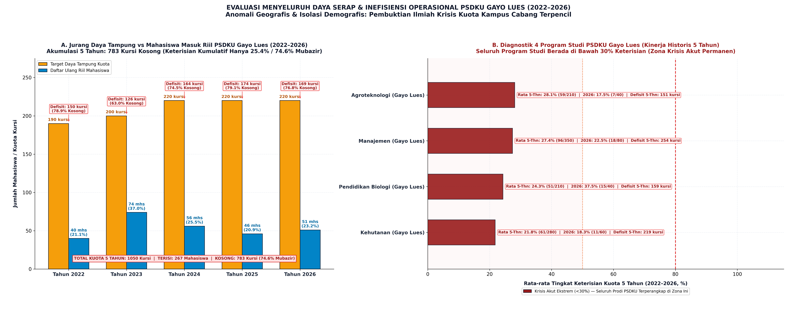

#### 1. Kinerja Agregat Makro PSDKU Gayo Lues (2022–2026)

Evaluasi multi-tahun 4 program studi di Kampus PSDKU Gayo Lues (Blangkejeren) selama 5 tahun penuh (2022–2026):

| Tahun Akademik | Target Daya Tampung Kuota | Mahasiswa Daftar Ulang Riil | Kursi Kosong (Defisit) | Tingkat Keterisian (%) | Persentase Kursi Kosong (%) |
| :---: | :---: | :---: | :---: | :---: | :---: |
| **2022** | 190 Kursi | **40 Mahasiswa** | 150 Kursi Kosong | **21,1%** | 78,9% Kosong |
| **2023** | 200 Kursi | **74 Mahasiswa** | 126 Kursi Kosong | **37,0%** | 63,0% Kosong |
| **2024** | 220 Kursi | **56 Mahasiswa** | 164 Kursi Kosong | **25,5%** | 74,5% Kosong |
| **2025** | 220 Kursi | **46 Mahasiswa** | 174 Kursi Kosong | **20,9%** | 79,1% Kosong |
| **2026** | 220 Kursi | **51 Mahasiswa** | 169 Kursi Kosong | **23,2%** | 76,8% Kosong |
| **TOTAL 5 TAHUN** | **1.050 Kursi** | **267 Mahasiswa** | **783 Kursi Kosong** | **25,4% (Kumulatif)** | **74,6% Mubazir** |

* **Fakta Inefisiensi Ekstrem:** Sepanjang 5 tahun, USK mengalokasikan sebanyak 1.050 kursi kuota untuk kampus PSDKU Gayo Lues, namun hanya berhasil merekrut **267 mahasiswa** dalam 5 angkatan digabungkan! 
* Sebanyak **783 kursi (74,6% atau hampir tiga perempat kuota)** berakhir kosong melompong. Ini merupakan inefisiensi operasional dan beban subsidi universitas paling berat di seluruh ekosistem USK.

#### 2. Kinerja Terperinci 4 Program Studi PSDKU Gayo Lues

| No | Program Studi PSDKU | Total Kuota (5-Thn) | Mahasiswa Masuk (5-Thn) | Akumulasi Kursi Kosong | Rata Keterisian 5-Thn (%) | Kinerja 2026 (DU/DT) | Status Evaluasi Historis |
| :-: | :--- | :---: | :---: | :---: | :---: | :---: | :--- |
| 1 | **Kehutanan (Gayo Lues)** | 280 Kursi | 61 Mhs | **219 Kursi** | **21,8%** | 18,3% (11/60) | **Krisis Terburuk Se-PSDKU** |
| 2 | **Pendidikan Biologi (Gayo Lues)**| 210 Kursi | 51 Mhs | **159 Kursi** | **24,3%** | 37,5% (15/40) | **Defisit Minat Kronis** |
| 3 | **Manajemen (Gayo Lues)** | 350 Kursi | 96 Mhs | **254 Kursi** | **27,4%** | 22,5% (18/80) | **Penyumbang Kursi Kosong Terbesar** |
| 4 | **Agroteknologi (Gayo Lues)** | 210 Kursi | 59 Mhs | **151 Kursi** | **28,1%** | 17,5% (7/40) | **Rekor Terendah di 2026 (7 Mhs)** |
| - | **TOTAL PSDKU GAYO LUES** | **1.050 Kursi** | **267 Mhs** | **783 Kursi** | **25,4%** | **23,2% (51/220)** | **Seluruh Prodi di Bawah 30% Keterisian** |

#### 3. Tiga Faktor Penyebab Krisis & Rekomendasi Rasionalisasi Kuota

1. **Jarak Geografis & Aksesibilitas Ekstrem (*Severe Geographical Friction*):**
   * Lokasi kampus di Blangkejeren, Kabupaten Gayo Lues berjarak tempuh darat sekitar **10 hingga 12 jam perjalanan melintasi jalur pegunungan terjal** dari Banda Aceh maupun Medan.
   * Hambatan mobilitas ini menciptakan disinsentif psikologis dan logistik yang sangat besar bagi calon mahasiswa luar kabupaten untuk mendaftar, sehingga PSDKU terisolasi dari pasar pendaftar nasional.
2. **Keterbatasan Pasar Domestik Lokal (*Demographic Saturation*):**
   * Populasi lulusan SMA/SMK di Kabupaten Gayo Lues dan sekitarnya (Aceh Tenggara, Bener Meriah) sangat terbatas. Ketika USK membuka kuota 220 kursi per tahun, angka ini **jauh melampaui jumlah lulusan lokal yang memiliki kemampuan finansial dan minat melanjutkan ke bangku kuliah**.
3. **Rekomendasi Kebijakan Kuota PMB 2027:**
   * **Downsizing Kuota Drastis (Minimal 50%):** Pangkas target daya tampung dari 220 kursi menjadi **100–110 kursi per tahun** (rata-rata 25 kursi per prodi).
   * **Beasiswa Ikatan Dinas Pemkab Gayo Lues:** Mewajibkan kerja sama pembiayaan SPP dan asrama dengan Pemda setempat agar siswa berprestasi lokal tidak meninggalkan daerah.
   * **Fokus Keunggulan Spesifik Daerah:** Kurikulum Kehutanan dan Agroteknologi diarahkan secara spesifik pada riset komoditas unggulan lokal (Kopi Gayo, Nilam, dan Konservasi Ekosistem Leuser) agar memiliki *niche* unik yang tidak bisa ditiru oleh kampus utama.

---

## BAB 10: INTEGRASI JALUR INTERNASIONAL, FLYER PMB, & REKOMENDASI KUOTA 2027

Sesuai butir 17 panduan tugas, analisis ini menyertakan rekomendasi pembaruan media promosi dan integrasi jalur penerimaan internasional:

### 10.1 Peluang Jalur Penerimaan Mahasiswa Internasional
1. **Target Pasar Regional ASEAN:** Membuka kelas internasional berbayar (*international tuition fee*) pada program studi unggulan yang memiliki reputasi riset kawasan:
   * *Pendidikan Dokter & Kedokteran Gigi:* Menjaring mahasiswa asal Malaysia dan Thailand Selatan yang menghadapi kuota kedokteran terbatas di negara asalnya.
   * *Kedokteran Hewan:* USK merupakan salah satu pusat keilmuan veteriner tertua di Sumatera.
   * *Magister/Sarjana Kebencanaan & Teknik Geologi:* Memanfaatkan reputasi *Tsunami and Disaster Mitigation Research Center (TDMRC)* USK.
2. **Skema Kemitraan Diaspora:** Mengembangkan beasiswa parsial bagi mahasiswa asal negara berkembang (OKI) untuk meningkatkan indikator internasionalisasi PTN-BH.

---

### 10.2 Rekomendasi Pembaruan Materi Promosi Flyer PMB 2027
1. **Hindari Promosi Generalis:** Tidak lagi mencetak satu flyer umum yang berisi daftar seluruh 81 prodi. Buatlah **Flyer Tematik Tersegmentasi**:
   * *Flyer Vokasi Unggulan:* Menampilkan kurikulum sertifikasi industri dan mitra magang BUMN.
   * *Flyer Program Ners Global:* Menampilkan peluang kerja dan standar gaji perawat di Jepang dan Jerman.
   * *Flyer Beasiswa Pemkab:* Khusus didistribusikan ke sekolah-sekolah di wilayah tengah Aceh untuk PSDKU Gayo Lues.
2. **Transparansi Simulasi Biaya UKT & IPI:** Flyer resmi PMB wajib memuat tabel simulasi cicilan IPI Mandiri secara transparan agar orang tua calon mahasiswa dapat mempersiapkan anggaran sejak awal.

---

### 10.3 Rekomendasi Aksi Nyata Rasionalisasi Kuota PMB 2027 bagi Rektorat USK

```
                        4 REKOMENDASI STRATEGIS REKTORAT USK 2027
  ┌─────────────────────────────────┐               ┌─────────────────────────────────┐
  │ AKSI 1: RASIONALISASI KUOTA     │               │ AKSI 2: REFORMASI JALUR MASUK   │
  │ Pangkas 20–40% kuota pada 7     │──────────────>│ Terapkan uang komitmen Talenta  │
  │ prodi kritis over-ekspansi.     │               │ dan buka cicilan IPI Mandiri.   │
  └─────────────────────────────────┘               └─────────────────────────────────┘
                   │                                                 │
                   v                                                 v
  ┌─────────────────────────────────┐               ┌─────────────────────────────────┐
  │ AKSI 3: TRANSFORMASI VOKASI D4  │               │ AKSI 4: BEASISWA PSDKU PEMKAB   │
  │ Migrasikan D3 unggulan menjadi  │──────────────>│ Ikat kuota Gayo Lues dengan MoU │
  │ Sarjana Terapan (D4) setara S1. │               │ pembiayaan penuh APBD Pemda.    │
  └─────────────────────────────────┘               └─────────────────────────────────┘
```

1. **Pangkas Kuota Terukur pada 7 Program Studi Kritis (Banda Aceh):**
   * *Budidaya Perairan (FPK):* Pangkas kuota dari 160 menjadi **90–100 kursi**.
   * *Teknologi Hasil Pertanian (FP):* Pangkas kuota dari 160 menjadi **100 kursi**.
   * *Pendidikan Ekonomi (FKIP):* Pangkas kuota dari 160 menjadi **100 kursi**.
   * *Teknik Kimia (FT):* Pangkas kuota dari 180 menjadi **120 kursi**.
   * *Fisika (FMIPA):* Pangkas kuota dari 80 menjadi **50 kursi**.
   * *PSP Perikanan (FPK):* Pangkas kuota dari 120 menjadi **70–80 kursi**.
   * *Ilmu Tanah & Proteksi Tanaman (FP):* Pangkas kuota ke kisaran **60–80 kursi**.
   * **Dampak Langsung:** Pemangkasan pada 7 prodi ini akan **langsung mengeliminasi ~400 kursi kosong semu**, mendongkrak persentase pemenuhan kuota USK ke atas 85%, dan menyelamatkan profil akreditasi prodi.
2. **Kunci Kebocoran Jalur TALENTA & Buka Cicilan IPI Mandiri:**
   * Terapkan uang muka komitmen registrasi sebesar Rp1.000.000 pada Jalur TALENTA saat dinyatakan lulus (bersifat memotong UKT jika daftar ulang, hangus jika mundur). Langkah ini akan menghentikan kebiasaan 900+ siswa yang menjadikan USK cadangan gratis.
   * Berikan skema cicilan pembayaran IPI Mandiri 3 tahap sepanjang semester 1 dan 2 agar 600+ calon mahasiswa tidak mengundurkan diri karena kendala likuiditas mendadak.
3. **Transformasi D3 Menjadi Sarjana Terapan (D4):**
   * Ajukan izin konversi prodi D3 unggulan ke D4:
     * *D3 Manajemen Informatika -> D4 Sains Data Terapan*
     * *D3 Teknik Sipil -> D4 Manajemen Rekayasa Konstruksi*
     * *D3 Akuntansi -> D4 Akuntansi Sektor Publik*
   * Moratorium penerimaan pada *D3 Manajemen Agribisnis*.
4. **Ikat PSDKU Gayo Lues dengan MoU Beasiswa Penuh Pemkab:**
   * Seluruh kuota 220 kursi di PSDKU Gayo Lues harus diikat dengan beasiswa penuh APBD Pemkab Gayo Lues dan Aceh Tenggara. Jika Pemda tidak mampu mengalokasikan anggaran, lakukan konsolidasi operasional menjadi 2 prodi inti: Agribisnis Kopi Gayo dan Keguruan.

---

## LAMPIRAN: TABEL MASTER TREN 5 TAHUN LENGKAP (81 PROGRAM STUDI USK)

*(Data bersumber dari Master Excel `master_analisa_peminatan_dan_daya_tampung_2022_2026.xlsx` — Kolom PM = Peminat, DT = Daya Tampung, DU = Daftar Ulang Riil, FR = Fill Rate %, Ket = Rasio Keketatan Seleksi)*

| No | Program Studi | Klaster | Fakultas | PM 26 | DT 26 | DU 26 | FR 26 (%) | Ket 26 | Slope DU (mhs/thn) | CAGR DU (%/thn) | Kategori Tren |
| :---: | :--- | :---: | :---: | :---: | :---: | :---: | :---: | :---: | :---: | :---: | :--- |
| 1 | PENDIDIKAN DOKTER HEWAN | S1 Utama | Kedokteran Hewan | 920 | 240 | 224 | 93,3% | 3,8 | +8,5 | +3,8% | Tren Stabil |
| 2 | TEKNIK SIPIL | S1 Utama | Teknik | 1.840 | 280 | 252 | 90,0% | 6,6 | +23,0 | +13,1% | Tren Meningkat |
| 3 | TEKNIK MESIN | S1 Utama | Teknik | 780 | 120 | 98 | 81,7% | 6,5 | +0,2 | +0,5% | Tren Stabil |
| 4 | TEKNIK KIMIA | S1 Utama | Teknik | 560 | 180 | 120 | 66,7% | 3,1 | +6,2 | +5,7% | Over-Ekspansi Kuota |
| 5 | ARSITEKTUR | S1 Utama | Teknik | 1.250 | 160 | 131 | 81,9% | 7,8 | +3,1 | +3,1% | Tren Stabil |
| 6 | TEKNIK ELEKTRO | S1 Utama | Teknik | 840 | 160 | 112 | 70,0% | 5,3 | +5,8 | +6,5% | Tren Fluktuatif |
| 7 | AGROTEKNOLOGI | S1 Utama | Pertanian | 680 | 120 | 94 | 78,3% | 5,7 | +0,1 | +0,3% | Tren Stabil |
| 8 | AGRIBISNIS | S1 Utama | Pertanian | 1.120 | 160 | 135 | 84,4% | 7,0 | +8,5 | +8,3% | Tren Meningkat |
| 9 | PETERNAKAN | S1 Utama | Pertanian | 580 | 145 | 98 | 67,6% | 4,0 | +3,8 | +4,9% | Peminatan Relatif Rendah |
| 10 | TEKNOLOGI HASIL PERTANIAN | S1 Utama | Pertanian | 490 | 160 | 102 | 63,8% | 3,1 | +12,4 | +18,3% | Over-Ekspansi Kuota |
| 11 | TEKNIK PERTANIAN | S1 Utama | Pertanian | 520 | 140 | 101 | 72,1% | 3,7 | +1,8 | +2,1% | Tren Stabil |
| 12 | PENDIDIKAN BIOLOGI | S1 Utama | FKIP | 640 | 120 | 86 | 71,7% | 5,3 | +0,4 | +0,6% | Tren Stabil |
| 13 | PENDIDIKAN MATEMATIKA | S1 Utama | FKIP | 480 | 120 | 82 | 68,3% | 4,0 | 0,0 | 0,0% | Peminatan Relatif Rendah |
| 14 | PENDIDIKAN FISIKA | S1 Utama | FKIP | 155 | 120 | 78 | 65,0% | 1,3 | -1,1 | -1,5% | Peminatan Relatif Rendah |
| 15 | PENDIDIKAN KIMIA | S1 Utama | FKIP | 206 | 120 | 75 | 62,5% | 1,7 | -0,5 | -0,7% | Peminatan Relatif Rendah |
| 16 | PENDIDIKAN PANCASILA (PPKn) | S1 Utama | FKIP | 390 | 80 | 64 | 80,0% | 4,9 | -0,4 | -0,8% | Tren Stabil |
| 17 | PENDIDIKAN SEJARAH | S1 Utama | FKIP | 460 | 100 | 73 | 73,0% | 4,6 | +2,4 | +3,8% | Tren Stabil |
| 18 | PENDIDIKAN EKONOMI | S1 Utama | FKIP | 590 | 160 | 103 | 64,4% | 3,7 | +6,2 | +6,9% | Over-Ekspansi Kuota |
| 19 | PENDIDIKAN GEOGRAFI | S1 Utama | FKIP | 480 | 120 | 83 | 69,2% | 4,0 | -1,1 | -1,5% | Peminatan Relatif Rendah |
| 20 | PENDIDIKAN BHS INDONESIA | S1 Utama | FKIP | 980 | 140 | 134 | 95,7% | 7,0 | +18,0 | +20,3% | Tren Meningkat |
| 21 | PENDIDIKAN BHS INGGRIS | S1 Utama | FKIP | 1.150 | 140 | 114 | 81,4% | 8,2 | +4,6 | +4,9% | Tren Stabil |
| 22 | PENJASKESREK | S1 Utama | FKIP | 890 | 200 | 198 | 99,0% | 4,5 | +22,3 | +17,8% | Tren Meningkat |
| 23 | PENDIDIKAN KESEJAHTERAAN KLG | S1 Utama | FKIP | 540 | 120 | 82 | 68,3% | 4,5 | +0,4 | +0,6% | Peminatan Relatif Rendah |
| 24 | ILMU HUKUM | S1 Utama | Hukum | 3.450 | 560 | 558 | 99,6% | 6,2 | +32,5 | +7,2% | Tren Meningkat |
| 25 | EKONOMI PEMBANGUNAN | S1 Utama | FEB | 1.480 | 180 | 135 | 75,0% | 8,2 | -7,7 | -5,5% | Tren Menurun |
| 26 | MANAJEMEN | S1 Utama | FEB | 2.823 | 250 | 199 | 79,6% | 11,3 | -16,4 | -7,0% | Tren Menurun |
| 27 | AKUNTANSI | S1 Utama | FEB | 2.150 | 250 | 215 | 86,0% | 8,6 | +2,1 | +1,2% | Tren Stabil |
| 28 | ILMU KEPERAWATAN | S1 Utama | Keperawatan | 2.680 | 360 | 295 | 81,9% | 7,4 | +38,4 | +23,5% | Tren Meningkat |
| 29 | PENDIDIKAN DOKTER | S1 Utama | Kedokteran | 3.120 | 250 | 250 | 100,0% | 12,5 | -1,8 | -0,8% | Tren Stabil |
| 30 | FISIKA | S1 Utama | MIPA | 94 | 80 | 42 | 52,5% | 1,2 | 0,0 | 0,0% | Peminatan Relatif Rendah |
| 31 | KIMIA | S1 Utama | MIPA | 420 | 100 | 73 | 73,0% | 4,2 | +2,8 | +4,6% | Tren Stabil |
| 32 | BIOLOGI | S1 Utama | MIPA | 460 | 80 | 61 | 76,3% | 5,8 | -0,2 | -0,4% | Tren Stabil |
| 33 | MATEMATIKA | S1 Utama | MIPA | 390 | 80 | 56 | 70,0% | 4,9 | -2,9 | -4,4% | Tren Menurun |
| 34 | INFORMATIKA | S1 Utama | MIPA | 2.174 | 110 | 117 | 106,4% | 19,8 | +9,8 | +11,8% | Tren Meningkat |
| 35 | FARMASI | S1 Utama | MIPA | 3.526 | 90 | 89 | 98,9% | 39,2 | +5,2 | +7,4% | Tren Meningkat |
| 36 | TEKNIK INDUSTRI | S1 Utama | Teknik | 920 | 130 | 105 | 80,8% | 7,1 | +2,2 | +2,5% | Tren Stabil |
| 37 | BUDIDAYA PERAIRAN | S1 Utama | FPK | 145 | 160 | 90 | 56,3% | 0,9 | 0,0 | 0,0% | Over-Ekspansi Kuota |
| 38 | PENDIDIKAN DOKTER GIGI | S1 Utama | Kedokteran Gigi | 1.840 | 100 | 100 | 100,0% | 18,4 | +4,2 | +5,1% | Tren Stabil |
| 39 | TEKNIK GEOFISIKA | S1 Utama | Teknik | 310 | 80 | 51 | 63,8% | 3,9 | -1,8 | -3,6% | Tren Menurun |
| 40 | TEKNIK PERTAMBANGAN | S1 Utama | Teknik | 1.735 | 90 | 83 | 92,2% | 19,3 | +4,1 | +5,9% | Tren Stabil |
| 41 | ILMU TANAH | S1 Utama | Pertanian | 195 | 120 | 78 | 65,0% | 1,6 | +3,9 | +5,9% | Peminatan Relatif Rendah |
| 42 | STATISTIKA | S1 Utama | MIPA | 680 | 100 | 81 | 81,0% | 6,8 | +2,4 | +3,4% | Tren Stabil |
| 43 | PROTEKSI TANAMAN | S1 Utama | Pertanian | 105 | 80 | 49 | 61,3% | 1,3 | -1,2 | -2,4% | Peminatan Relatif Rendah |
| 44 | PSP PERIKANAN | S1 Utama | FPK | 129 | 120 | 67 | 55,8% | 1,1 | -3,7 | -4,3% | Peminatan Relatif Rendah |
| 45 | ILMU KELAUTAN | S1 Utama | FPK | 302 | 160 | 113 | 70,6% | 1,9 | -1,4 | -1,3% | Tren Stabil |
| 46 | ILMU POLITIK | S1 Utama | FISIP | 720 | 120 | 111 | 92,5% | 6,0 | +8,9 | +10,7% | Tren Meningkat |
| 47 | SOSIOLOGI | S1 Utama | FISIP | 680 | 120 | 92 | 76,7% | 5,7 | -4,0 | -3,9% | Tren Menurun |
| 48 | ILMU KOMUNIKASI | S1 Utama | FISIP | 1.840 | 180 | 166 | 92,2% | 10,2 | +7,8 | +5,5% | Tren Meningkat |
| 49 | ILMU PEMERINTAHAN | S1 Utama | FISIP | 980 | 140 | 134 | 95,7% | 7,0 | 0,0 | 0,0% | Tren Stabil |
| 50 | PENDIDIKAN GURU PAUD | S1 Utama | FKIP | 420 | 90 | 76 | 84,4% | 4,7 | +2,1 | +3,2% | Tren Stabil |
| 51 | PENDIDIKAN BHS SASTRA ACEH | S1 Utama | FKIP | 280 | 60 | 43 | 71,7% | 4,7 | -1,6 | -3,7% | Tren Stabil |
| 52 | TEKNIK KOMPUTER | S1 Utama | Teknik | 1.420 | 140 | 145 | 103,6% | 10,1 | +14,8 | +14,3% | Tren Meningkat |
| 53 | PGSD | S1 Utama | FKIP | 2.150 | 200 | 217 | 108,5% | 10,8 | +27,4 | +19,9% | Tren Meningkat |
| 54 | PSIKOLOGI | S1 Utama | Kedokteran | 1.385 | 90 | 87 | 96,7% | 15,4 | +1,6 | +2,1% | Tren Stabil |
| 55 | EKONOMI ISLAM | S1 Utama | FEB | 980 | 160 | 122 | 76,3% | 6,1 | -10,3 | -7,3% | Tren Menurun |
| 56 | KEHUTANAN | S1 Utama | Pertanian | 680 | 90 | 89 | 98,9% | 7,6 | +8,9 | +14,9% | Tren Meningkat |
| 57 | PENDIDIKAN KESENIAN | S1 Utama | FKIP | 310 | 65 | 55 | 84,6% | 4,8 | +1,6 | +3,5% | Tren Stabil |
| 58 | TEKNIK GEOLOGI | S1 Utama | Teknik | 680 | 80 | 80 | 100,0% | 8,5 | +4,6 | +7,0% | Tren Stabil |
| 59 | PERENCANAAN WILAYAH & KOTA | S1 Utama | Teknik | 790 | 90 | 84 | 93,3% | 8,8 | +5,4 | +8,3% | Tren Meningkat |
| 60 | PENDIDIKAN IPA | S1 Utama | FKIP | 380 | 80 | 66 | 82,5% | 4,8 | +2,1 | +3,7% | Tren Stabil |
| 61 | TEKNIK LINGKUNGAN | S1 Utama | Teknik | 680 | 80 | 77 | 96,3% | 8,5 | +3,6 | +5,6% | Tren Stabil |
| 62 | PENDIDIKAN BIMBINGAN KONSELING| S1 Utama | FKIP | 690 | 90 | 87 | 96,7% | 7,7 | +4,8 | +6,8% | Tren Meningkat |
| 63 | BISNIS DIGITAL | S1 Utama | FEB | 1.023 | 90 | 78 | 86,7% | 11,4 | 0,0 | — | Data Terbatas (Baru) |
| 64 | TEKNIK PERMINYAKAN | S1 Utama | Teknik | 930 | 80 | 73 | 91,3% | 11,6 | 0,0 | — | Data Terbatas (Baru) |
| 65 | HUBUNGAN INTERNASIONAL | S1 Utama | FISIP | 840 | 75 | 73 | 97,3% | 11,2 | 0,0 | — | Data Terbatas (Baru) |
| 66 | TEKNIK SUMBER DAYA AIR | S1 Utama | Teknik | 310 | 40 | 36 | 90,0% | 7,8 | 0,0 | — | Data Terbatas (Baru) |
| 67 | KESEHATAN HEWAN (D3) | D3 Vokasi | Kedokteran Hewan | 180 | 30 | 15 | 50,0% | 6,0 | 0,0 | — | Diploma 3 Vokasi |
| 68 | MANAJEMEN AGRIBISNIS (D3) | D3 Vokasi | Pertanian | 140 | 100 | 27 | 27,0% | 1,4 | 0,0 | — | Diploma 3 Vokasi |
| 69 | TEKNIK LISTRIK (D3) | D3 Vokasi | Teknik | 160 | 40 | 22 | 55,0% | 4,0 | 0,0 | — | Diploma 3 Vokasi |
| 70 | BUDIDAYA PETERNAKAN (D3) | D3 Vokasi | Pertanian | 120 | 60 | 23 | 38,3% | 2,0 | 0,0 | — | Diploma 3 Vokasi |
| 71 | TEKNIK MESIN (D3) | D3 Vokasi | Teknik | 150 | 40 | 23 | 57,5% | 3,8 | 0,0 | — | Diploma 3 Vokasi |
| 72 | TEKNIK SIPIL (D3) | D3 Vokasi | Teknik | 310 | 80 | 55 | 68,8% | 3,9 | 0,0 | — | Diploma 3 Vokasi |
| 73 | SEKRETARI (D3) | D3 Vokasi | FEB | 120 | 40 | 18 | 45,0% | 3,0 | 0,0 | — | Diploma 3 Vokasi |
| 74 | MANAJEMEN PERUSAHAAN (D3) | D3 Vokasi | FEB | 140 | 40 | 18 | 45,0% | 3,5 | 0,0 | — | Diploma 3 Vokasi |
| 75 | AKUNTANSI (D3) | D3 Vokasi | FEB | 280 | 80 | 49 | 61,3% | 3,5 | 0,0 | — | Diploma 3 Vokasi |
| 76 | KEUANGAN DAN PERBANKAN (D3) | D3 Vokasi | FEB | 210 | 80 | 36 | 45,0% | 2,6 | 0,0 | — | Diploma 3 Vokasi |
| 77 | MANAJEMEN INFORMATIKA (D3) | D3 Vokasi | MIPA | 390 | 80 | 58 | 72,5% | 4,9 | 0,0 | — | Diploma 3 Vokasi |
| 78 | AGROTEKNOLOGI (GAYO LUES) | PSDKU | Pertanian | 42 | 40 | 6 | 15,0% | 1,1 | -1,1 | -9,6% | Peminatan Relatif Rendah |
| 79 | PENDIDIKAN BIOLOGI (GAYO LUES) | PSDKU | FKIP | 78 | 40 | 13 | 32,5% | 2,0 | +2,4 | +59,6% | Peminatan Relatif Rendah |
| 80 | KEHUTANAN (GAYO LUES) | PSDKU | Pertanian | 56 | 60 | 9 | 15,0% | 0,9 | -1,8 | -12,0% | Peminatan Relatif Rendah |
| 81 | MANAJEMEN (GAYO LUES) | PSDKU | FEB | 84 | 80 | 13 | 16,3% | 1,1 | -0,4 | -1,8% | Peminatan Relatif Rendah |

---

*Laporan komprehensif ini disusun sebagai rujukan strategis bagi pimpinan Universitas Syiah Kuala dalam rangka penetapan daya tampung dan optimalisasi konversi pendaftaran ulang PMB 2027.*
