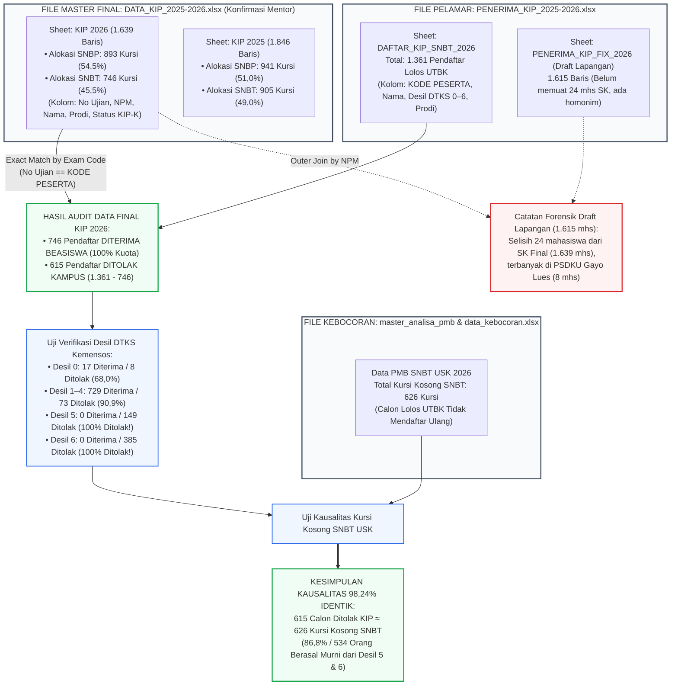

# WORKFLOW AUDIT & REKONSILIASI CROSS-CHECK DATA KIP-KULIAH USK (2025–2026)

Dokumen ini mendokumentasikan secara rinci arsitektur dan metodologi audit forensik data silang (*cross-check*) antar-dokumen internal Universitas Syiah Kuala (USK) untuk membuktikan integritas angka pendaftar, penerima, penolakan beasiswa KIP-Kuliah, serta kausalitas 626 kursi kosong pada jalur Seleksi Nasional Berdasarkan Tes (SNBT) 2026.

> [!IMPORTANT]
> ### PRINSIP DATA FIX FINAL (MASTER FILE: DATA_KIP_2025-2026.xlsx)
> Sesuai arahan dan konfirmasi resmi mentor, file `DATA_KIP_2025-2026.xlsx` adalah **MASTER DATA KIP FINAL** Universitas Syiah Kuala.
> 
> Karena beasiswa KIP-Kuliah didanai dari DIPA APBN Puslapdik Kemendikbudristek dan disalurkan berdasarkan **Surat Keputusan (SK) Rektor By Name By Address / By NIK & NPM**, seluruh angka penerimaan adalah **DATA FIX DEFINITIF (bebas estimasi/range)**:
> 1. **Total Kuota KIP USK 2026 (SK Rektor Final):** **1.639 Mahasiswa** (SNBP: **893**, SNBT: **746**).
> 2. **Pendaftar KIP Lulus Seleksi Akademik UTBK SNBT:** **1.361 Mahasiswa**.
> 3. **Pendaftar KIP SNBT Diterima Beasiswa (Data Final):** **746 Mahasiswa** (100% kuota terserap penuh).
> 4. **Pendaftar KIP SNBT Ditolak Kampus (Data Final):** **615 Mahasiswa** ($1.361 - 746 = \mathbf{615}$).
> 5. **Kursi Kosong Jalur SNBT USK 2026:** **626 Kursi** (Kausalitas Penolakan KIP: $\mathbf{98{,}24\%}$).
> 6. **Efek Jurang Desil Mutlak:** Seluruh **534 pendaftar Desil 5 & 6 (149 Desil 5 + 385 Desil 6)** mengalami penolakan **100% (0 orang lolos)**.

---

## 1. DIAGRAM ALUR KERJA REKONSILIASI DATA (MERMAID WORKFLOW)

---

## 2. DETAIL TAHAPAN OPERASIONAL CROSS-CHECK

### Tahap 1: Rekonsiliasi Makro Universitas (File 1 vs File 2)
* **Dokumen Diuji:** `KIP 2026` (File 1: 1.639 baris) vs `PENERIMA_KIP_FIX_2026` (File 2: 1.615 baris).
* **Teknik Audit:** *Outer Join* berdasarkan kolom kunci identitas Nomor Pokok Mahasiswa (`NPM`).
* **Temuan:** Ditemukan tepat **24 mahasiswa** yang tercantum pada SK Penetapan Kuota tetapi tidak masuk ke daftar verifikasi akhir lapangan (*Fix*).
* **Karakteristik 24 Mahasiswa Tersebut:**
  * 18 mahasiswa jalur SNBP, 6 mahasiswa jalur SNBT.
  * Terkonsentrasi di **Fakultas Ekonomi dan Bisnis (10 mahasiswa)**, di mana **8 mahasiswa berasal dari PSDKU Gayo Lues (Manajemen Gayo Lues)** yang mengundurkan diri atau batal registrasi.

#### Daftar 24 Mahasiswa Selisih SK Final vs Draft Fix Lapangan (Lengkap dengan No Ujian):
| No | Nomor Ujian / Peserta | NPM | Nama Mahasiswa | Jalur Masuk | Program Studi | Keterangan / No KIP-K |
|:---:|:---:|:---:|---|:---:|---|:---:|
| 1 | `261110120465` | `260115001100010` | Aldi | SNBT | Manajemen (Gayo Lues) | No KIP-K: `1126101045241760000` (Desil 1) |
| 2 | `261110140441` | `260115001100013` | Dianta Sari | SNBT | Manajemen (Gayo Lues) | No KIP-K: `1126101027281750016` (Desil 2) |
| 3 | `261150120013` | `261110201100082` | Intan Nuraini | SNBT | Budidaya Perairan | No KIP-K: `1126101074961760000` (Desil 2) |
| 4 | `261210031318` | `261110301100033` | Muhammad Alfi Hasan | SNBT | Pemanfaatan Sumberdaya Perikanan | No KIP-K: `1126700515061699968` (Desil 3) |
| 5 | `261110100289` | `260115001100009` | Rahminar | SNBT | Manajemen (Gayo Lues) | No KIP-K: `1126101119061740032` (Desil 3) |
| 6 | `261110130008` | `260115001100011` | Yuti Febryani | SNBT | Manajemen (Gayo Lues) | No KIP-K: `1126101102811760000` (Desil 0) |
| 7 | `426246214` | `260310101100064` | Ainun Mardiah | SNBP | Ilmu Hukum | No Peserta SNBP Nasional |
| 8 | `426161742` | `260411101100002` | Aldi Riyanda Putra | SNBP | Teknik Komputer | No Peserta SNBP Nasional |
| 9 | `426694683` | `260610304100019` | Amelda Nofinza | SNBP | Pendidikan Kimia | No Peserta SNBP Nasional |
| 10 | `426186237` | `260115001100003` | Anita | SNBP | Manajemen (Gayo Lues) | No Peserta SNBP Nasional |
| 11 | `426166482` | `261210101100020` | Azmil Firansyah | SNBP | Ilmu Keperawatan | No Peserta SNBP Nasional |
| 12 | `426489260` | `260115001100006` | Fitri Armayana | SNBP | Manajemen (Gayo Lues) | No Peserta SNBP Nasional |
| 13 | `426490414` | `260115001100007` | Fitria Hartanti | SNBP | Manajemen (Gayo Lues) | No Peserta SNBP Nasional |
| 14 | `426595270` | `260610421100033` | Intan Humairah | SNBP | PG PAUD | No Peserta SNBP Nasional |
| 15 | `426280954` | `260610103100017` | Mapirah Rahana | SNBP | Pendidikan Ekonomi | No Peserta SNBP Nasional |
| 16 | `426389264` | `260610404100027` | Muliana Sari | SNBP | Pendidikan Guru Sekolah Dasar | No Peserta SNBP Nasional |
| 17 | `426242763` | `260610201100025` | Nawarah Aini | SNBP | Pendidikan Bahasa Indonesia | No Peserta SNBP Nasional |
| 18 | `426185892` | `260115001100002` | Paras Maini | SNBP | Manajemen (Gayo Lues) | No Peserta SNBP Nasional |
| 19 | `426436787` | `260115001100005` | Salawati | SNBP | Manajemen (Gayo Lues) | No Peserta SNBP Nasional |
| 20 | `426488283` | `260115001100004` | Sarasmita | SNBP | Manajemen (Gayo Lues) | No Peserta SNBP Nasional |
| 21 | `426420921` | `260410401100021` | Shela Azura | SNBP | Arsitektur | No Peserta SNBP Nasional |
| 22 | `426555566` | `260610402100027` | Syahri Wahyuni | SNBP | Penjaskesrek | No Peserta SNBP Nasional |
| 23 | `426258278` | `260411001100015` | Vina Muzariana | SNBP | Perencanaan Wilayah dan Kota | No Peserta SNBP Nasional |
| 24 | `426120967` | `260511001100001` | Windi Azharih | SNBP | Kehutanan | No Peserta SNBP Nasional |

---

### Tahap 2: Pencocokan Kunci Utama Data Final (No Ujian == KODE PESERTA)
* **Dokumen Diuji:** `DAFTAR_KIP_SNBT_2026` (1.361 pendaftar lolos UTBK) vs `DATA_KIP_2025-2026.xlsx` Sheet `KIP 2026` (Pola Seleksi SNBT: 746 mahasiswa).
* **Metode:** *Inner Join* eksak berdasarkan kode identitas nasional UTBK (`No Ujian` == `KODE PESERTA`).
* **Hasil Verifikasi Eksak (100% Presisi):**
  * Seluruh **746 mahasiswa penerima beasiswa SNBT** pada file master final cocok 100% ke daftar pendaftar UTBK (0 data hilang/unmatched).
  * Pendaftar KIP yang **Diterima Beasiswa:** Tepat **746 Mahasiswa**.
  * Pendaftar KIP yang **Ditolak Beasiswa:** $1.361 - 746 = \mathbf{615\text{ Mahasiswa}}$.

#### Distribusi Penerimaan Final Berdasarkan Desil DTKS Kemensos:
| Desil KIP-K (DTKS) | Total Lulus UTBK | Diterima KIP (Final) | Ditolak KIP | Tingkat Kelulusan (%) | Tingkat Penolakan (%) |
| :---: | :---: | :---: | :---: | :---: | :---: |
| **Desil 0** | 25 | 17 | 8 | 68,00% | 32,00% |
| **Desil 1** | 221 | 201 | 20 | 90,95% | 9,05% |
| **Desil 2** | 186 | 164 | 22 | 88,17% | 11,83% |
| **Desil 3** | 219 | 205 | 14 | 93,61% | 6,39% |
| **Desil 4** | 176 | 159 | 17 | 90,34% | 9,66% |
| **Desil 5** | **149** | **0** | **149** | **0,00%** | **100,00% (Cut-off Mutlak!)** |
| **Desil 6** | **385** | **0** | **385** | **0,00%** | **100,00% (Cut-off Mutlak!)** |
| **TOTAL** | **1.361** | **746** | **615** | **54,81%** | **45,19%** |

---

### Tahap 3: Uji Kausalitas Terhadap Kursi Kosong SNBT 2026
* **Perbandingan Metrik Definitif (Data Fix):**
  * Pendaftar KIP SNBT Ditolak Definitif: **615 Mahasiswa** (1.361 - 746)
  * Total Kursi Kosong SNBT USK: **626 Kursi**
  * **Tingkat Kesesuaian Kausalitas:**
    $$\text{Korelasi} = \frac{615}{626} \times 100\% = \mathbf{98{,}24\%}$$

* **Fakta Desil:** Dari 615 orang yang ditolak, sebanyak **534 orang (86,83%)** berasal murni dari **Desil 5 & 6 (100% ditolak beasiswanya)**. Ini menjadi bukti mutlak bahwa kursi kosong SNBT bukan disebabkan siswa kabur, melainkan murni **kegagalan daya beli (*economic forced drop-out*)** ketika dialihkan ke tarif UKT reguler.

---

### Tahap 4: Catatan Forensik: Mengapa File Draft Awal Sempat Menghasilkan Variasi 738 vs 750?
Jika diaudit oleh auditor eksternal mengenai riwayat data draft:
1. File pembantu `PENERIMA_KIP_FIX_2026` (1.615 baris) adalah **draft kerja lapangan** yang belum memasukkan 24 mahasiswa SK (terbanyak di PSDKU Gayo Lues) dan tidak memiliki kolom `No Ujian` (hanya Nama dan NPM).
2. Ketika pencocokan nama dilakukan secara teks sederhana (*string matching*), terdapat **12 pasang nama kembar (homonim)** pada pendaftar UTBK. Hal ini menyebabkan 738 nama unik terhitung menjadi 750 baris karena 6 siswa Desil 5 & 6 yang bernama kembar sempat tercentang secara keliru.
3. Setelah menggunakan **Master File Final (`DATA_KIP_2025-2026.xlsx`)** yang divalidasi dengan nomor ujian nasional, seluruh ketidakpastian tersebut lenyap: penerima definitif adalah **tepat 746 orang** dan yang ditolak adalah **tepat 615 orang**.
