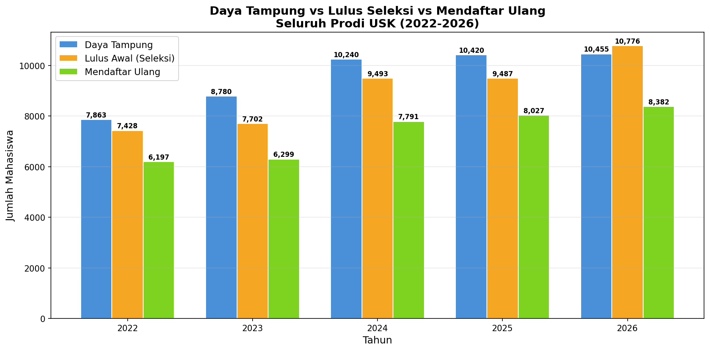
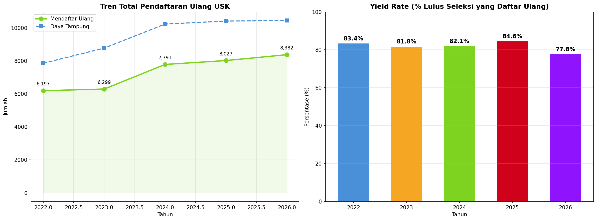
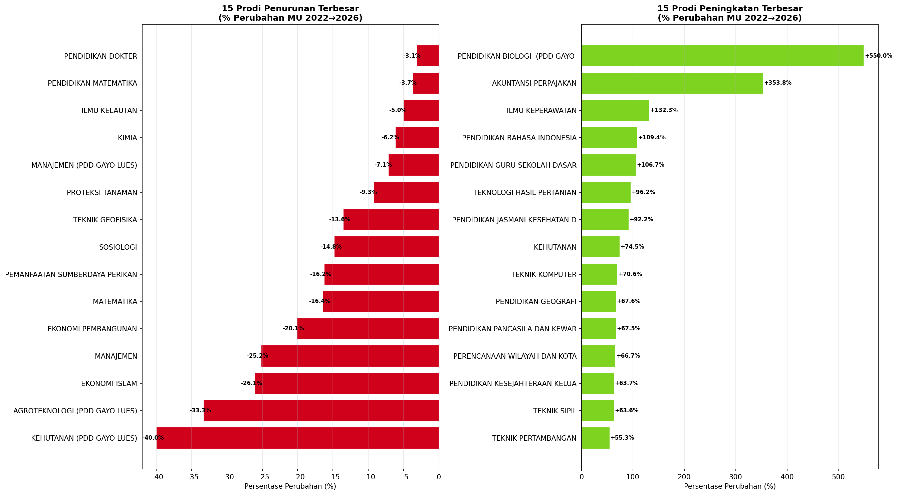
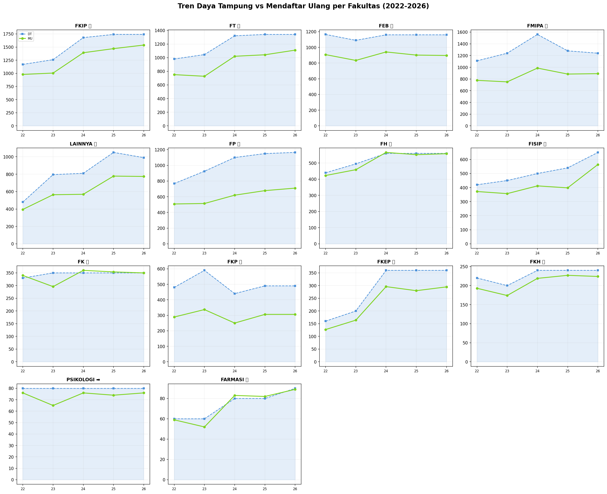
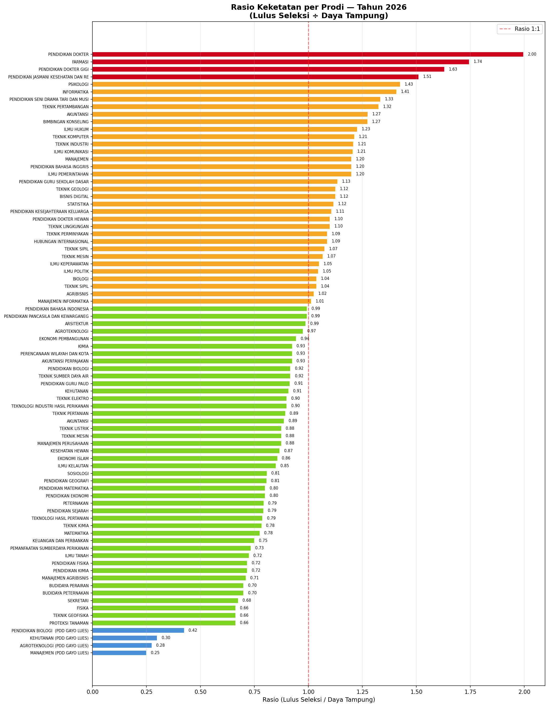
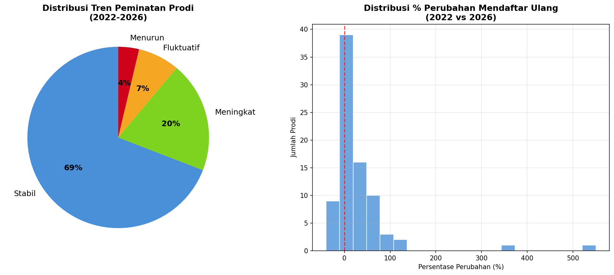
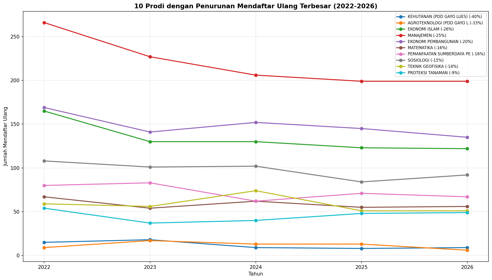
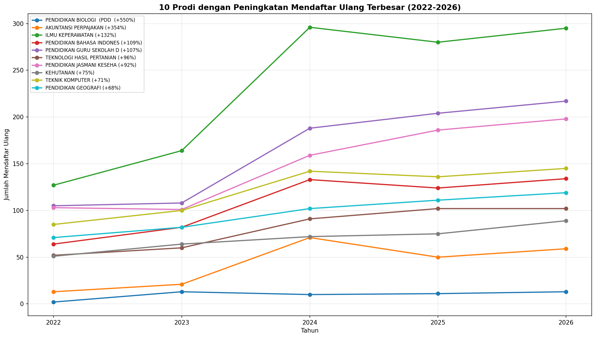
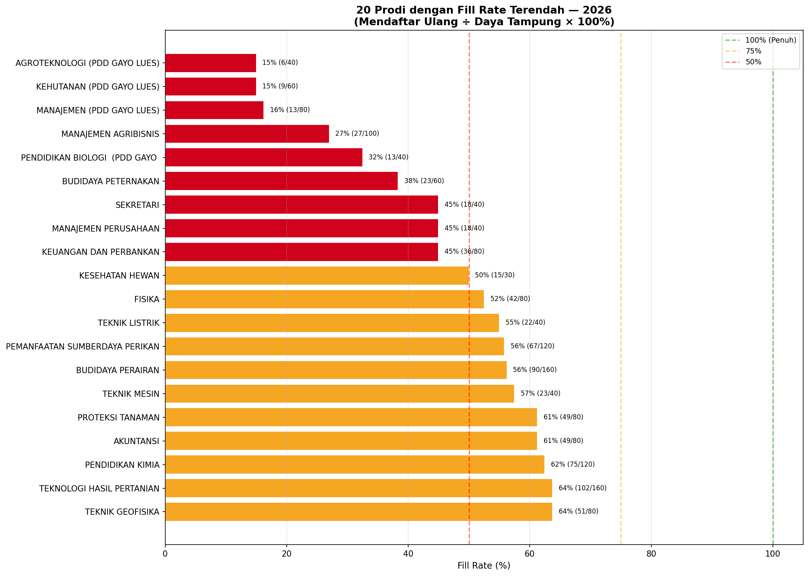
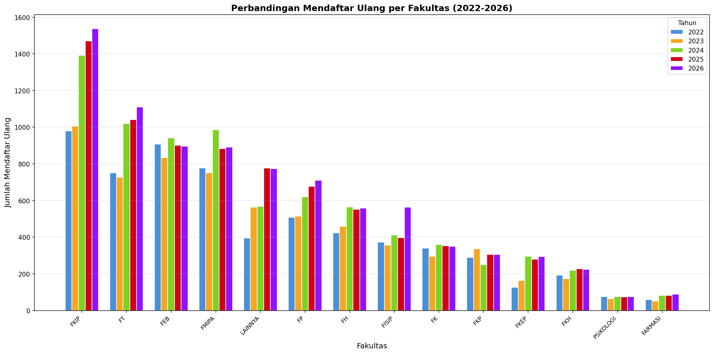

# 📊 Laporan Analisis Peminatan & Daya Tampung Prodi USK
## Periode 2022 — 2026

---

## 1️⃣ Overview: Daya Tampung vs Lulus Seleksi vs Mendaftar Ulang

| Tahun | Daya Tampung | Lulus Seleksi | Mendaftar Ulang | Perubahan MU |
|:-----:|:-----------:|:------------:|:---------------:|:------------:|
| 2022 | 8,360 | 8,614 | **6,197** | — |
| 2023 | 8,535 | 8,696 | **6,299** | +1.6% |
| 2024 | 11,200 | 11,259 | **7,791** | +23.7% |
| 2025 | 11,510 | 11,506 | **8,027** | +3.0% |
| 2026 | 11,710 | 12,167 | **8,382** | +4.4% |

> [!IMPORTANT]
> Total mendaftar ulang USK **naik 35.3%** dalam 5 tahun (6,197 → 8,382). Lonjakan terbesar terjadi di **2024 (+23.7%)** — kemungkinan terkait penambahan daya tampung dan jalur baru (TALENTA, Cadangan, ADIK).

---

## 2️⃣ Tren Total & Yield Rate

**Yield Rate** = % mahasiswa yang lulus seleksi dan benar-benar mendaftar ulang.

| Tahun | Yield Rate |
|:-----:|:---------:|
| 2022 | 71.9% |
| 2023 | 72.4% |
| 2024 | 69.2% |
| 2025 | 69.8% |
| 2026 | 68.9% |

> [!WARNING]
> Yield rate cenderung **menurun** dari 72.4% (2023) ke 68.9% (2026). Artinya semakin banyak mahasiswa yang lulus seleksi tapi **tidak jadi mendaftar ulang**. Ini perlu diteliti lebih lanjut — kemungkinan faktor: UKT, pilihan kampus lain, atau pindah jalur.

---

## 3️⃣ Prodi dengan Perubahan Terbesar (2022 → 2026)

### 📈 Top 5 Peningkatan

| Prodi | 2022 | 2026 | Perubahan |
|-------|:----:|:----:|:---------:|
| Pendidikan Biologi (PDD Gayo Lues) | 2 | 13 | **+550%** |
| Akuntansi Perpajakan | 13 | 59 | **+354%** |
| Ilmu Keperawatan | 127 | 295 | **+132%** |
| Pendidikan Bahasa Indonesia | 64 | 134 | **+109%** |
| PGSD | 105 | 217 | **+107%** |

### 📉 Top 5 Penurunan

| Prodi | 2022 | 2026 | Perubahan |
|-------|:----:|:----:|:---------:|
| Kehutanan (PDD Gayo Lues) | 15 | 9 | **-40%** |
| Agroteknologi (PDD Gayo Lues) | 9 | 6 | **-33%** |
| Ekonomi Islam | 165 | 122 | **-26%** |
| Manajemen | 266 | 199 | **-25%** |
| Ekonomi Pembangunan | 169 | 135 | **-20%** |

---

## 4️⃣ Tren per Fakultas

---

## 5️⃣ Rasio Keketatan per Prodi (2026)

> [!NOTE]
> **Rasio > 1.0** = lebih banyak yang lulus seleksi daripada daya tampung (prodi populer).
> **Rasio < 1.0** = daya tampung belum terisi penuh (perlu perhatian).

---

## 6️⃣ Distribusi Tren Prodi

| Kategori Tren | Jumlah Prodi | Persentase |
|:-------------|:------------:|:----------:|
| ✅ Stabil | 56 | 69% |
| 📈 Meningkat | 16 | 20% |
| 📊 Fluktuatif | 6 | 7% |
| 📉 Menurun | 3 | 4% |

> [!TIP]
> Mayoritas prodi (69%) memiliki tren **stabil**. Hanya 3 prodi yang mengalami tren menurun konsisten. Ini menunjukkan peminatan di USK secara umum **sehat**.

---

## 7️⃣ 10 Prodi Tren Menurun

---

## 8️⃣ 10 Prodi Tren Meningkat

---

## 9️⃣ Prodi dengan Fill Rate Terendah (2026)

> [!CAUTION]
> Prodi **PDD Gayo Lues** mendominasi daftar fill rate terendah (15-32%). Ini menunjukkan program studi di kampus satelit memerlukan perhatian khusus — kemungkinan faktor: lokasi geografis, akses, atau kurangnya sosialisasi.

---

## 🔟 Perbandingan Mendaftar Ulang antar Fakultas

---

## 💡 Key Findings

### Temuan Positif
1. **Total mahasiswa baru USK naik 35%** dalam 5 tahun
2. **69% prodi** memiliki tren stabil, 20% meningkat
3. Prodi kesehatan (**Ilmu Keperawatan +132%**, **Kedokteran Gigi**) menunjukkan peningkatan signifikan
4. Prodi pendidikan (**PGSD +107%**, **Pend. Bahasa Indonesia +109%**) juga naik pesat

### Temuan yang Perlu Perhatian
1. **Yield rate menurun** dari 72.4% ke 68.9% — banyak yang lulus tapi tidak daftar ulang
2. **PDD Gayo Lues** fill rate sangat rendah (15%) — isu lokasi/akses
3. **Ekonomi Islam (-26%)** dan **Manajemen (-25%)** mengalami penurunan signifikan
4. Beberapa prodi pertanian/kehutanan menunjukkan tren menurun

### Hipotesis Awal untuk Riset Lanjutan
| No | Hipotesis | Prodi Terkait | Data Pendukung yang Dibutuhkan |
|----|-----------|---------------|-------------------------------|
| 1 | Kenaikan UKT berkorelasi dengan penurunan yield rate | Semua prodi | Data UKT 2022-2026 |
| 2 | Prodi di lokasi terpencil sulit menarik peminat | PDD Gayo Lues | Data akses transportasi, sosialisasi |
| 3 | Tren industri digital mengurangi minat prodi konvensional | Manajemen, Ekonomi | Data tren karir, lowongan kerja |
| 4 | Prodi kesehatan naik karena dampak pasca-pandemi | Keperawatan, Kedokteran | Data kebutuhan nakes nasional |
| 5 | Prodi pendidikan naik karena kebijakan guru ASN | PGSD, Pend. Bahasa | Data formasi CPNS guru |

---

## 📂 File yang Dihasilkan

| File | Lokasi |
|------|--------|
| Data Rekap 2022-2026 | [REKAP_DATA_MABA_2022_2026.xlsx](file:///Users/auliamuzhaffar/Documents/maganghub/REKAP_DATA_MABA_2022_2026.xlsx) |
| Grafik (10 file PNG) | [grafik_analisis/](file:///Users/auliamuzhaffar/Documents/maganghub/grafik_analisis) |
